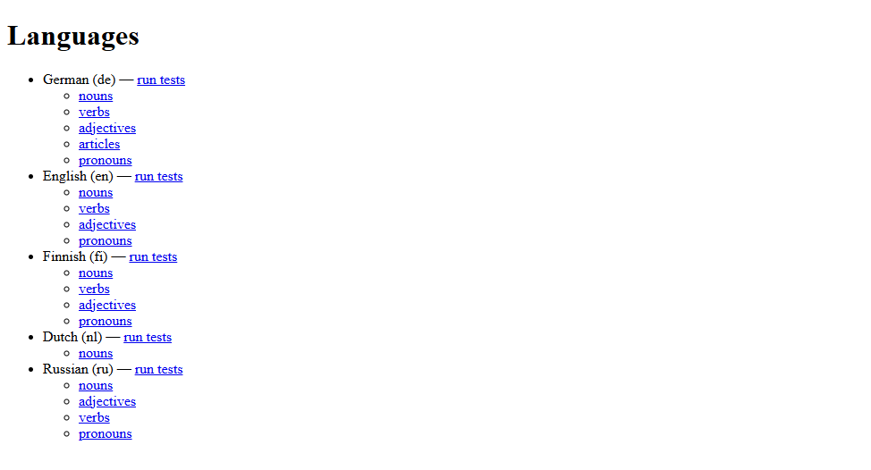
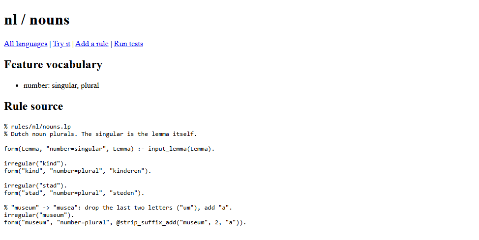
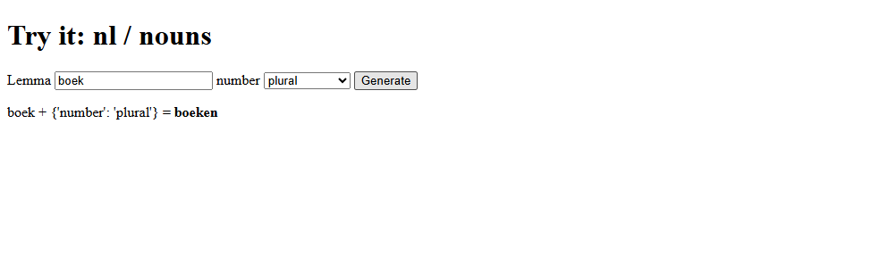
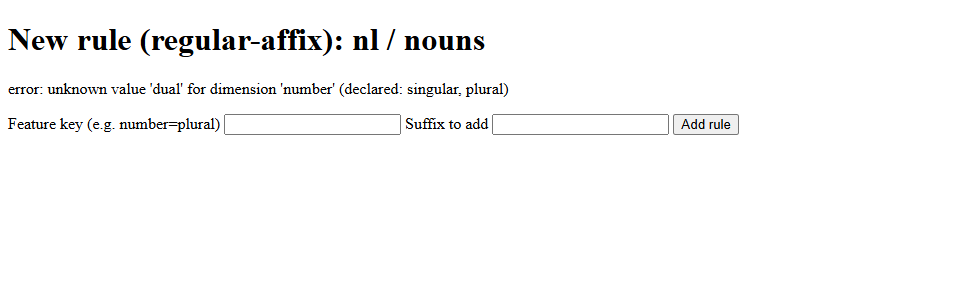
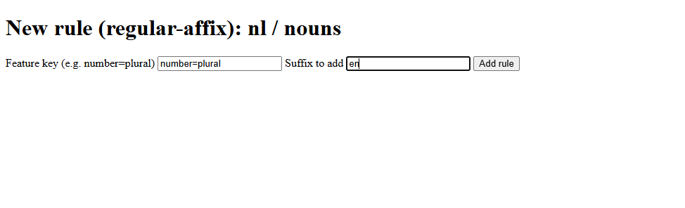
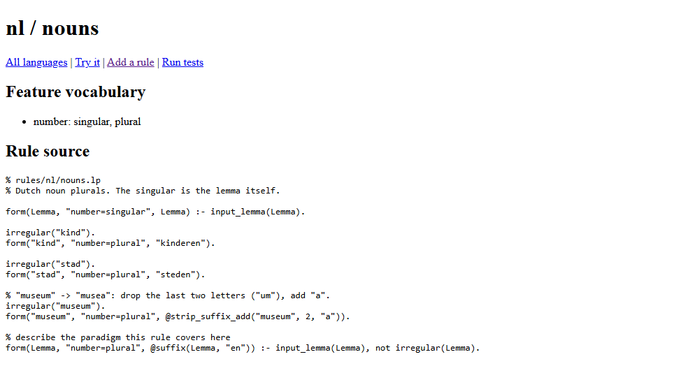
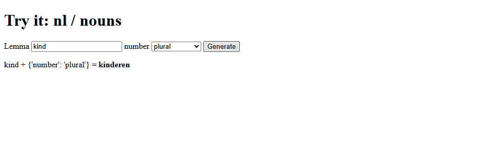
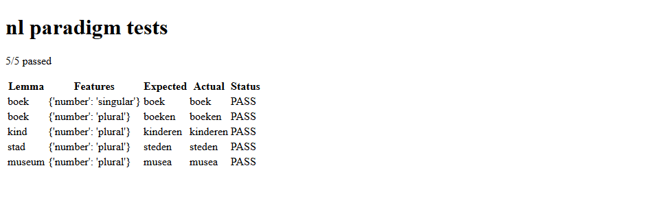
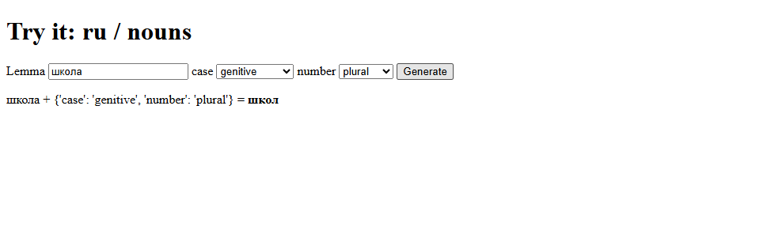

# lingua-rules

**English** | [Русский](README.ru.md)

A system for linguists to author, browse, and test natural language grammar
rules. Rules are written as Clingo (Answer Set Programming) files, organized
per language and word category, and executed locally — no database, no
external service. Rules for **English, German, Russian and Finnish** —
nouns, verbs, adjectives, pronouns and (German) articles — are included.

The full design is in `docs/superpowers/specs/2026-09-05-lingua-rules-design.md`.

This README shows how to run lingua-rules with plain `python` (no shell aliases,
no `lingua-rules` command on your `PATH`, no activated virtual environment), how
rule templates work, which templates exist, and how to change them or add your
own. Every command and output below was run against this repository.

- [1. Install](#1-install)
- [2. Run the tools with `python -m`](#2-run-the-tools-with-python--m)
- [3. The web UI](#3-the-web-ui)
- [4. Rule files](#4-rule-files)
- [5. Rule templates](#5-rule-templates)
- [6. Worked example: adding a language (Dutch)](#6-worked-example-adding-a-language-dutch)
- [7. Changing templates](#7-changing-templates)
- [8. Languages included](#8-languages-included)
- [9. Golden-file tests](#9-golden-file-tests)
- [10. Pitfalls and known limitations](#10-pitfalls-and-known-limitations)
- [11. Regenerating the screenshots](#11-regenerating-the-screenshots)

---

## 1. Install

You need **Python 3.11 or newer** and `git`.

```
git clone https://github.com/DenisBaliuckij/lingua-rules.git
cd lingua-rules
```

Create a virtual environment and install the package into it. You never have
to *activate* it: every command below calls the environment's own interpreter
directly.

**Windows (PowerShell or cmd):**

```
python -m venv .venv
.venv\Scripts\python.exe -m pip install -e ".[dev]"
```

**Linux / macOS:**

```
python3 -m venv .venv
.venv/bin/python -m pip install -e ".[dev]"
```

In the rest of this README, `python` means that interpreter:
`.venv\Scripts\python.exe` on Windows, `.venv/bin/python` on Linux/macOS.
(If you prefer, activate the environment once and plain `python` will do.)

### Running without installing the package

You can also run straight from the source tree. Install only the dependencies,
then put `src/` on `PYTHONPATH`:

```
python -m pip install "clingo>=5.7" "typer>=0.12" "fastapi>=0.110" "python-multipart>=0.0.9" "jinja2>=3.1" "uvicorn>=0.29" "pyyaml>=6.0"
```

| Shell | Command |
|---|---|
| PowerShell | `$env:PYTHONPATH = "src"; python -m lingua_rules.cli.main generate en nouns child --features number=plural` |
| cmd | `set PYTHONPATH=src` then `python -m lingua_rules.cli.main generate en nouns child --features number=plural` |
| Linux / macOS | `PYTHONPATH=src python -m lingua_rules.cli.main generate en nouns child --features number=plural` |

Output: `children`.

---

## 2. Run the tools with `python -m`

Every command is `python -m lingua_rules.cli.main <command> ...`. Run them from
the repository root: by default they read rules from `./rules` and tests from
`./tests`. Every command accepts `--rules-dir` (and `test`/`serve` also
`--tests-dir`) to point elsewhere.

```
python -m lingua_rules.cli.main --help
python -m lingua_rules.cli.main <command> --help
```

| Command | What it does |
|---|---|
| `generate LANG CATEGORY LEMMA --features k=v[,k=v]` | Produce one word form |
| `test [LANG] [--category C]` | Run golden-file tests (all languages if `LANG` is omitted) |
| `lint LANG` | Check rule files for Clingo parse errors and undeclared features |
| `new-rule LANG CATEGORY --template T ...` | Append a rule written from a template (section 5) |
| `serve [--host H] [--port P]` | Start the web UI (section 3) |

Examples with their real output:

```
> python -m lingua_rules.cli.main generate en nouns cat --features number=plural
cats
> python -m lingua_rules.cli.main generate en nouns child --features number=plural
children

> python -m lingua_rules.cli.main test en --category nouns
[PASS] cat {'number': 'plural'} expected='cats' actual='cats'
[PASS] cat {'number': 'singular'} expected='cat' actual='cat'
[PASS] child {'number': 'plural'} expected='children' actual='children'
...
21/21 passed

> python -m lingua_rules.cli.main lint en
en: no issues found
```

Errors are one line and the exit code is 1:

```
> python -m lingua_rules.cli.main generate en nouns cat --features number=dual
error: unknown value 'dual' for dimension 'number' (declared: singular, plural)
```

> **Note.** `python -m lingua_rules` (without `.cli.main`) does **not** work:
> the package has no `__main__.py`. Always use `lingua_rules.cli.main`.

### Output encoding

The CLI always writes its output as UTF-8, so letters such as ä, ö, ü, ß or
Cyrillic work everywhere — in a console window, redirected to a file, or piped
to another program — including on Windows with a legacy code page such as 1251:

```
python -m lingua_rules.cli.main generate de nouns Mann --features case=nominative,number=plural > result.txt
```

`result.txt` contains `Männer` (UTF-8). Open such files as UTF-8 in your editor.

---

## 3. The web UI

```
python -m lingua_rules.cli.main serve
python -m lingua_rules.cli.main serve --host 0.0.0.0 --port 9000
python -m lingua_rules.cli.main serve --rules-dir D:\work\rules --tests-dir D:\work\tests
```

Then open http://127.0.0.1:8000 (or the host/port you chose). Stop it with
Ctrl+C.

To run it under uvicorn directly, set the two directory variables yourself
(the web app reads them on every request; they default to `rules` and `tests`):

| Shell | Command |
|---|---|
| PowerShell | `$env:LINGUA_RULES_DIR = "rules"; $env:LINGUA_TESTS_DIR = "tests"; python -m uvicorn lingua_rules.web.app:app --port 8000` |
| Linux / macOS | `LINGUA_RULES_DIR=rules LINGUA_TESTS_DIR=tests python -m uvicorn lingua_rules.web.app:app --port 8000` |

What the UI offers (screenshots from the worked example in section 6):

**Languages** — every language under `rules/`, its categories, and a link to
its tests.



**Category page** — the feature vocabulary and the full rule source, with links
to *Try it*, *Add a rule* and *Run tests*.



**Try it** — type a lemma, pick feature values, press *Generate*. The form
shows only the features that category's rules use. Features that every rule of
the category uses are preselected; the others start at *— not set —* and are
left out of the request unless you pick a value (for Russian verbs, for
example, `verb_form` is preselected while `person`, `number` and `gender`
start unset, because the present and the past use different ones).



**Add a rule** — adds a `regular-affix` rule (the only template the web form
offers; use the CLI for the others). **Run tests** — the golden-file tests as a
table. Both are shown step by step in section 6.

---

## 4. Rule files

Each language is a folder `rules/<code>/`:

| File | Content |
|---|---|
| `lang.yaml` | `name`, optional `iso639_3`, and the list of `categories` |
| `features.yaml` | `dimensions`: each feature and its allowed values |
| `<category>.lp` | Clingo (Answer Set Programming) rules for that category |

```yaml
# rules/en/lang.yaml
name: English
iso639_3: eng
categories:
  - nouns
  - verbs
  - adjectives
  - pronouns
```

```yaml
# rules/en/features.yaml
dimensions:
  number:
    values: [singular, plural]
  verb_form:
    values: [base, present_3sg, past, past_participle, present_participle]
  degree:
    values: [positive, comparative, superlative]
  case:
    values: [subject, object, possessive_determiner, possessive_pronoun, reflexive]
```

```prolog
% rules/en/nouns.lp
form(Lemma, "number=singular", Lemma) :- input_lemma(Lemma).
form(Lemma, "number=plural", @suffix(Lemma, "s")) :- input_lemma(Lemma), not irregular(Lemma).

irregular("child").
form("child", "number=plural", "children").
```

How a rule file is evaluated:

- The lemma you ask for arrives as the fact `input_lemma("cat")`.
- Every rule derives `form(Lemma, FeatureKey, Form)`. The tool returns the
  `Form` whose `Lemma` and `FeatureKey` match the request.
- The **feature key** is a string: `dimension=value` pairs, **sorted
  alphabetically by dimension** and joined with `;` — for example
  `number=plural`, or `case=genitive;number=plural` when there are two
  dimensions. `new-rule` and the web form write keys in this order for you, in
  whatever order you type them; `lint` reports a hand-written key in any other
  order and prints the correct one.
- `irregular("x")` marks a lemma as an exception. Rules that end with
  `not irregular(Lemma)` then skip it, so its forms must be given explicitly.
- A category needs its `.lp` file to exist before the category page will open.

String helpers you can call from a rule (Clingo has no string operators, so
these are Python functions called with `@`):

| Helper | Result | Example |
|---|---|---|
| `@suffix(Lemma, "s")` | lemma + suffix | `cat` → `cats` |
| `@prefix(Lemma, "un")` | prefix + lemma | `happy` → `unhappy` |
| `@strip_suffix_add(Lemma, 2, "en")` | drop the last N letters, then add a string | `Museum` → `Museen` |

---

## 5. Rule templates

A template is a ready-made rule block that the tool fills in and **appends to
the end** of `rules/<lang>/<category>.lp`. After that it is ordinary text: you
can edit or delete it like any other line in the file.

Before writing, the tool checks that all required fields are present, that
feature dimensions and values are declared in `features.yaml`, and that no value
contains a line break. Quotes and backslashes are escaped automatically.

### Available templates

| Template | Use it for | Required fields | CLI flags | Web UI |
|---|---|---|---|---|
| `regular-affix` | A regular rule that adds a suffix to every non-exception lemma | feature key, suffix | `--feature-key`, `--suffix` | yes (*Add a rule*) |
| `exception-override` | One irregular lemma with an explicit form | lemma, feature key, form | `--lemma`, `--feature-key`, `--form` | no |

**`regular-affix`**

```
python -m lingua_rules.cli.main new-rule nl nouns --template regular-affix --feature-key number=plural --suffix en
```

appends:

```prolog

% describe the paradigm this rule covers here
form(Lemma, "number=plural", @suffix(Lemma, "en")) :- input_lemma(Lemma), not irregular(Lemma).
```

Replace the comment line with a short description of the paradigm.

**`exception-override`**

```
python -m lingua_rules.cli.main new-rule nl nouns --template exception-override --feature-key number=plural --lemma kind --form kinderen
```

appends:

```prolog

irregular("kind").
form("kind", "number=plural", "kinderen").
```

`irregular("kind")` switches off **every** rule ending in
`not irregular(Lemma)` for `kind`, not only the plural one. If a language has
several regular rules, give each irregular lemma all the forms those rules would
have produced (repeat the command with other feature keys, or add `form(...)`
lines by hand).

### Rules without a template

Anything the templates don't cover is written by hand in the `.lp` file, using
the helpers from section 4. For example, a stem change:

```prolog
% "Museum" -> "Museen": drop the last two letters ("um"), add "en".
irregular("Museum").
form("Museum", "number=plural", @strip_suffix_add("Museum", 2, "en")).
```

Run `python -m lingua_rules.cli.main lint <lang>` after editing by hand.

---

## 6. Worked example: adding a language (Dutch)

This walkthrough adds a new language, Dutch (`nl`), with one category, and
uses both templates plus one hand-written rule. It is exactly what
`docs/screenshots/capture.py` does (in a temporary copy) to produce the
screenshots; Dutch is only an example and is not part of the repository's
rules.

**Step 1 — create the language files.**

`rules/nl/lang.yaml`

```yaml
name: Dutch
iso639_3: nld
categories:
  - nouns
```

`rules/nl/features.yaml`

```yaml
dimensions:
  number:
    values: [singular, plural]
```

`rules/nl/nouns.lp` — start with the singular, which is the lemma itself:

```prolog
% rules/nl/nouns.lp
% Dutch noun plurals. The singular is the lemma itself.

form(Lemma, "number=singular", Lemma) :- input_lemma(Lemma).
```

**Step 2 — add irregular plurals with `exception-override`.**

```
python -m lingua_rules.cli.main new-rule nl nouns --template exception-override --feature-key number=plural --lemma kind --form kinderen
python -m lingua_rules.cli.main new-rule nl nouns --template exception-override --feature-key number=plural --lemma stad --form steden
```

Each prints `appended exception-override scaffold to rules\nl\nouns.lp`.

**Step 3 — add a hand-written rule** at the end of `rules/nl/nouns.lp`:

```prolog
% "museum" -> "musea": drop the last two letters ("um"), add "a".
irregular("museum").
form("museum", "number=plural", @strip_suffix_add("museum", 2, "a")).
```

The category page now shows the file so far:


**Step 4 — add the regular plural with the web form** (`serve`, open *nl →
nouns → Add a rule*). The form checks the feature key against
`features.yaml`; a value that is not declared is rejected:



With a valid key (`number=plural`, suffix `en`):



After *Add rule* you are returned to the category page with the new block at
the end (the CLI equivalent is the `regular-affix` command in section 5):



**Step 5 — try it.** A regular noun uses the new rule; an exception uses its
override:




The same from the command line:

```
> python -m lingua_rules.cli.main generate nl nouns boek --features number=plural
boeken
> python -m lingua_rules.cli.main generate nl nouns museum --features number=plural
musea
```

**Step 6 — add golden-file tests** in `tests/nl/nouns.paradigm.yaml` (format in
section 9) and run them — on the command line with
`python -m lingua_rules.cli.main test nl`, or in the UI via *Run tests*:



---

## 7. Changing templates

There are two different things you may want to change.

### 7.1 Change a rule that a template has already written

Open `rules/<lang>/<category>.lp` in any text editor and edit the block. The
template is not remembered anywhere; the file is the only source of truth. Then
run `lint` and `test`.

### 7.2 Change what a template writes, or add a new template

Templates live in `src/lingua_rules/engine/templates.py`. Each one is a Python
string with `{field}` placeholders, plus a list of required fields:

```python
REGULAR_AFFIX_TEMPLATE = (
    "\n"
    "% describe the paradigm this rule covers here\n"
    'form(Lemma, "{feature_key}", @suffix(Lemma, "{suffix}")) :- '
    "input_lemma(Lemma), not irregular(Lemma).\n"
)

_TEMPLATES = {
    "regular-affix": REGULAR_AFFIX_TEMPLATE,
    "exception-override": EXCEPTION_OVERRIDE_TEMPLATE,
}

_TEMPLATE_REQUIRED_FIELDS = {
    "regular-affix": ("feature_key", "suffix"),
    "exception-override": ("lemma", "feature_key", "form"),
}
```

**To change an existing template**, edit its string — for example the comment
line. Keep the `{...}` placeholders and keep every placeholder inside `"..."`
quotes in the Clingo text (values are escaped for use inside a quoted string).
Only rules added from then on are affected; existing `.lp` files are not
rewritten.

**To add a template**, e.g. `regular-prefix` for `happy` → `unhappy`:

1. In `src/lingua_rules/engine/templates.py`, add the text and register it:

   ```python
   REGULAR_PREFIX_TEMPLATE = (
       "\n"
       "% describe the paradigm this rule covers here\n"
       'form(Lemma, "{feature_key}", @prefix(Lemma, "{prefix}")) :- '
       "input_lemma(Lemma), not irregular(Lemma).\n"
   )

   _TEMPLATES = {
       "regular-affix": REGULAR_AFFIX_TEMPLATE,
       "exception-override": EXCEPTION_OVERRIDE_TEMPLATE,
       "regular-prefix": REGULAR_PREFIX_TEMPLATE,
   }

   _TEMPLATE_REQUIRED_FIELDS = {
       "regular-affix": ("feature_key", "suffix"),
       "exception-override": ("lemma", "feature_key", "form"),
       "regular-prefix": ("feature_key", "prefix"),
   }
   ```

2. In `src/lingua_rules/cli/main.py`, give `new-rule` a flag for the new field
   and pass it on:

   ```python
       suffix: str = typer.Option(None, "--suffix"),
       prefix: str = typer.Option(None, "--prefix"),
   ```

   ```python
       fields = {
           "feature_key": feature_key,
           "suffix": suffix,
           "prefix": prefix,
           "lemma": lemma,
           "form": form,
       }
   ```

3. Use it:

   ```
   > python -m lingua_rules.cli.main new-rule demo adjectives --template regular-prefix --feature-key polarity=negative --prefix un
   appended regular-prefix scaffold to rules\demo\adjectives.lp
   > python -m lingua_rules.cli.main generate demo adjectives happy --features polarity=negative
   unhappy
   ```

4. Run `python -m pytest` and add a test for the new template under
   `tests_unit/engine/test_templates.py`.

The web form (*Add a rule*) is fixed to `regular-affix`; offering another
template there means changing `new_rule_submit` in `src/lingua_rules/web/app.py`
and `src/lingua_rules/web/templates/new_rule.html`.

---

## 8. Languages included

Four languages, every major inflecting part of speech. Each rule file starts
with a comment that lists its classes and what it does **not** cover.

| Language | Category | Features | Classes | Irregular words | Golden cases |
|---|---|---|---|---|---|
| English (`en`) | nouns | number | template rules + spelling rules | 18 | 21 |
| | verbs | verb_form (base, 3sg, past, past participle, -ing) | 4 + doubled consonant | 58 | 105 |
| | adjectives | degree | 3 + doubled consonant | 6 | 42 |
| | pronouns | case, number | listed | — | 40 |
| German (`de`) | nouns | case (4) × number | 10 declension classes | 12 | 128 |
| | verbs | infinitive, present, past, participle, imperative × person, number | 3 weak classes | 24 strong/modal | 206 |
| | adjectives | degree; strong/weak/mixed declension × case × gender × number | regular + stem classes | 13 | 145 |
| | articles | case × gender × number | der; ein-words; der-words | — | 92 |
| | pronouns | case, number | listed | — | 36 |
| Russian (`ru`) | nouns | case (6) × number, animacy | 16 declension classes | 14 | 372 |
| | adjectives | case × gender × number, animacy; comparative | 4 (hard, soft, velar, hushing) | 10 comparatives | 161 |
| | verbs | infinitive, present, past (by gender), imperative; future of быть | 4 conjugation classes | 18 | 165 |
| | pronouns | case, number | listed | — | 48 |
| Finnish (`fi`) | nouns | case (12, incl. accusative) × number | 15 inflection classes | 8 | 480 |
| | verbs | infinitive, present, past, imperative × person, number | 12 (types 1, 3, 4, 5) | 15 | 270 |
| | adjectives | degree | 4 | 10 | 33 |
| | pronouns | case (12), number | listed | — | 72 |

**How the rules are organised.** English and German regular words need no
entry at all (the template-style rules cover them). Where the right ending
depends on how a word is spelled or which class it belongs to — which a rule
cannot see — each word is given its class with one fact, and every class has
one rule per form:

```prolog
noun_class("школа", f_a).

form(L, "case=genitive;number=plural", @strip_suffix_add(L, 1, "")) :- input_lemma(L), noun_class(L, f_a).
```

To add a word of an existing class, add one fact such as `noun_class(...)`,
`verb_class(...)` or `adj_class(...)` to the right file. A word without a class
(in the languages that need one) produces no forms, and `generate` reports
`no rule ... produced a form`. Truly irregular words are marked
`irregular(...)` and list all their forms.

*Try it* shows each category only the features its rules use:



```
> python -m lingua_rules.cli.main generate fi nouns talo --features case=inessive,number=plural
taloissa
> python -m lingua_rules.cli.main generate ru verbs рисовать --features number=plural,person=third,verb_form=present
рисуют
> python -m lingua_rules.cli.main generate de adjectives klein --features case=dative,declension=strong,gender=masculine,number=singular
kleinem
```

**Regenerating the rules.** The larger rule files are produced from tables by
`tools/gen_en.py`, `tools/gen_de.py`, `tools/gen_ru.py` and `tools/gen_fi.py`
(run from the repository root). To add many words or a new class, edit the
tables there and re-run the script; the golden tests are regenerated from
separately typed-out word forms. Small additions can also be made directly in
the `.lp` files.

---

## 9. Golden-file tests

Each file `tests/<lang>/<category>.paradigm.yaml` holds one or more YAML
documents separated by `---`, one per lemma:

```yaml
lemma: boek
category: nouns
cases:
  - features: {number: singular}
    expected: boek
  - features: {number: plural}
    expected: boeken
---
lemma: kind
category: nouns
cases:
  - features: {number: plural}
    expected: kinderen
```

```
python -m lingua_rules.cli.main test nl
python -m lingua_rules.cli.main test nl --category nouns
python -m lingua_rules.cli.main test            # every language under tests/
```

The unit tests of the tool itself run with `python -m pytest`.

---

## 10. Pitfalls and known limitations

- **Feature-key order in hand-written rules.** Keys must be sorted by
  dimension name (`number=plural;tense=past`). Templates sort them for you;
  for rules you type yourself, run `lint`, which reports any key in another
  order, for example:
  `[verbs] feature key 'tense=past;number=plural' is not in canonical order and will never match; write 'number=plural;tense=past'`.
- **`irregular` is all-or-nothing** per lemma (see section 5).
- **Try it with forms that use different features.** Where some forms of a
  category use features others don't (Russian verbs: `person` in the present,
  `gender` in the past), those features start at *— not set —*; set exactly the
  ones the form you want needs.
- **The web form only adds `regular-affix` rules**; use `new-rule` for
  `exception-override`.
- **No undo.** Templates append to the file; remove unwanted blocks by editing
  the `.lp` file.
- A language whose file has no `irregular(...)` facts yet prints a harmless
  Clingo note (`info: atom does not occur in any rule head: irregular(Lemma)`)
  before the result.

---

## 11. Regenerating the screenshots

The screenshots in `docs/images/` are made with Selenium by
`docs/screenshots/capture.py`. It builds the Dutch example in a temporary
copy of `rules/` and `tests/` (the repository's own files are not changed),
starts the web UI, and captures each page in a headless browser.

```
python -m pip install -e ".[docs]"
python docs/screenshots/capture.py                 # Microsoft Edge
python docs/screenshots/capture.py --browser chrome
```

Selenium downloads the matching browser driver automatically.
