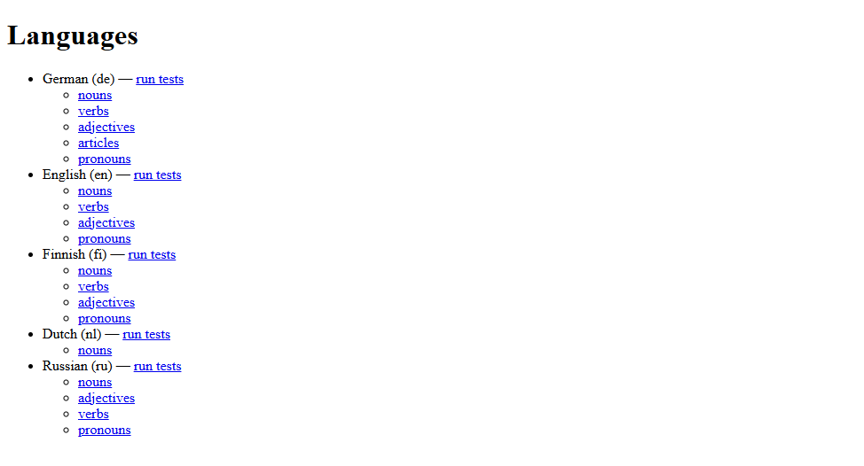
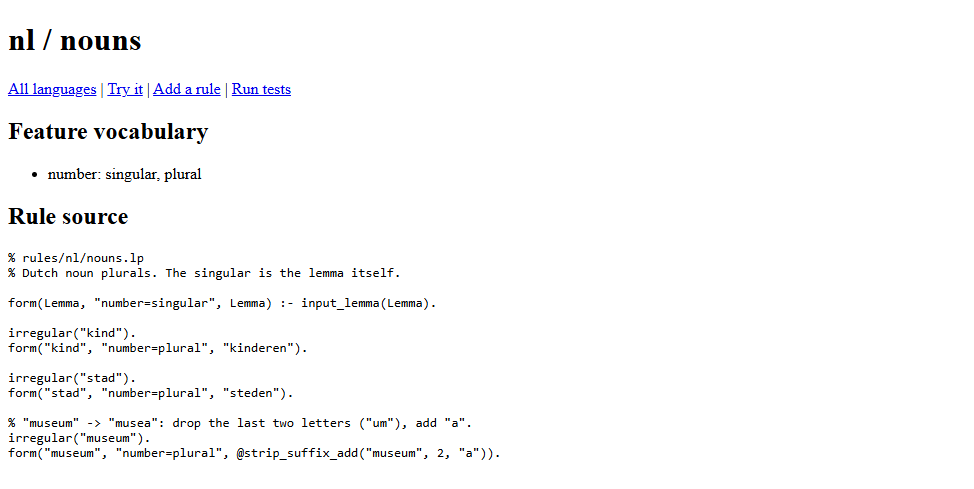
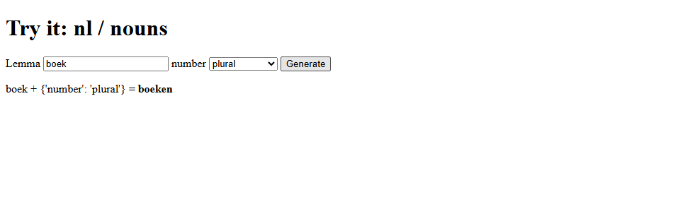
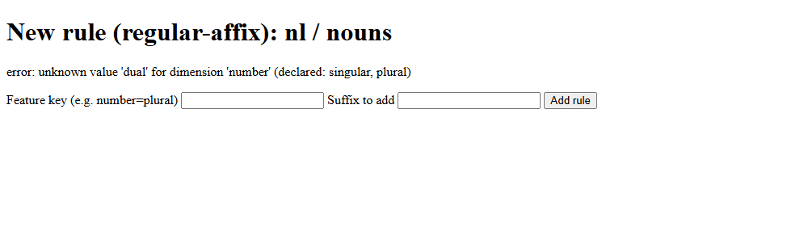
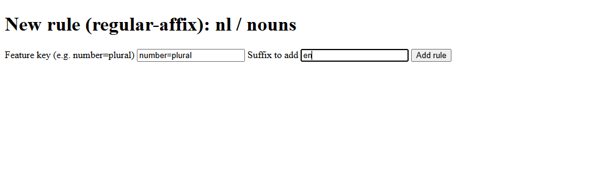
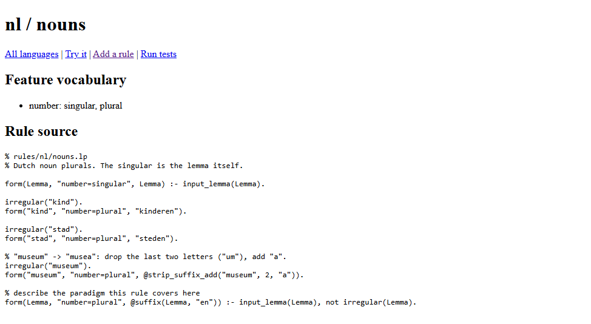
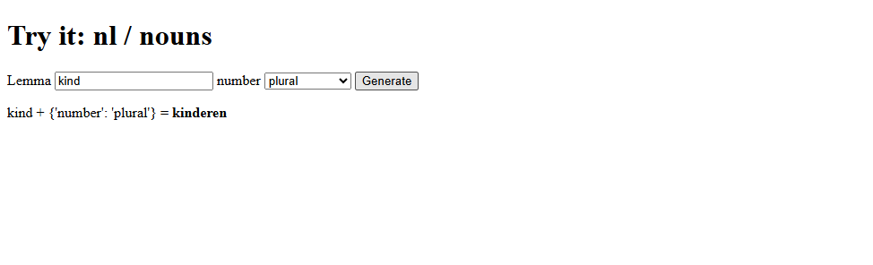
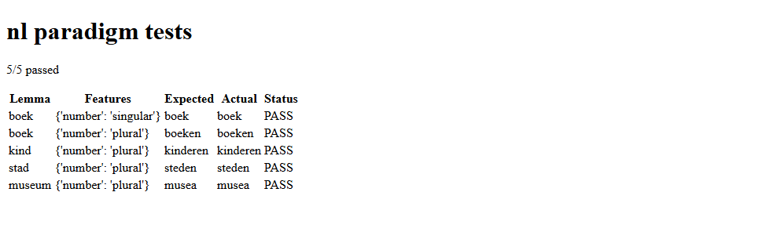
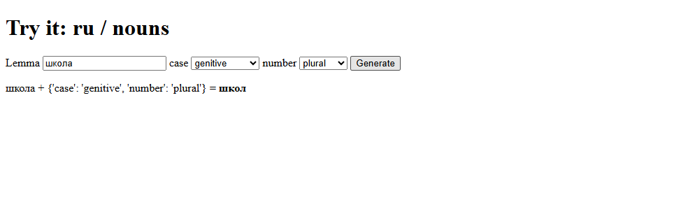

# lingua-rules

[English](README.md) | **Русский**

Система для лингвистов, позволяющая записывать, просматривать и проверять
грамматические правила естественных языков. Правила пишутся в виде файлов
Clingo (Answer Set Programming), разложены по языкам и частям речи и
выполняются локально — без базы данных и внешних сервисов. В репозитории есть
правила для **английского, немецкого, русского и финского** языков:
существительные, глаголы, прилагательные, местоимения и (в немецком) артикли.

Полное описание архитектуры — в `docs/superpowers/specs/2026-09-05-lingua-rules-design.md`.

Этот документ показывает, как запускать lingua-rules обычным `python` (без
псевдонимов в оболочке, без команды `lingua-rules` в `PATH`, без активации
виртуального окружения), как устроены шаблоны правил, какие шаблоны есть и как
их изменить или добавить свой. Все команды и их вывод ниже проверены на этом
репозитории.

> **Впервые работаете с командной строкой, Git или GitHub?** Начните с
> [раздела 12](#12-подробное-руководство-для-начинающих): там по шагам
> описано всё — от установки программ до добавления слов, правил, тестов и
> отправки изменений на проверку.

- [1. Установка](#1-установка)
- [2. Запуск через `python -m`](#2-запуск-через-python--m)
- [3. Веб-интерфейс](#3-веб-интерфейс)
- [4. Файлы правил](#4-файлы-правил)
- [5. Шаблоны правил](#5-шаблоны-правил)
- [6. Пример: добавление языка (нидерландский)](#6-пример-добавление-языка-нидерландский)
- [7. Изменение шаблонов](#7-изменение-шаблонов)
- [8. Языки в репозитории](#8-языки-в-репозитории)
- [9. Эталонные тесты](#9-эталонные-тесты)
- [10. Подводные камни и известные ограничения](#10-подводные-камни-и-известные-ограничения)
- [11. Как обновить скриншоты](#11-как-обновить-скриншоты)
- [12. Подробное руководство для начинающих](#12-подробное-руководство-для-начинающих)

---

## 1. Установка

Нужны **Python 3.11 или новее** и `git`.

```
git clone https://github.com/DenisBaliuckij/lingua-rules.git
cd lingua-rules
```

Создайте виртуальное окружение и установите в него пакет. Активировать его
**не нужно**: все команды ниже вызывают интерпретатор окружения напрямую.

**Windows (PowerShell или cmd):**

```
python -m venv .venv
.venv\Scripts\python.exe -m pip install -e ".[dev]"
```

**Linux / macOS:**

```
python3 -m venv .venv
.venv/bin/python -m pip install -e ".[dev]"
```

Дальше в тексте `python` означает именно этот интерпретатор:
`.venv\Scripts\python.exe` в Windows, `.venv/bin/python` в Linux/macOS.
(Можно один раз активировать окружение — тогда подойдёт и просто `python`.)

### Запуск без установки пакета

Можно запускать прямо из исходников. Установите только зависимости и добавьте
`src/` в `PYTHONPATH`:

```
python -m pip install "clingo>=5.7" "typer>=0.12" "fastapi>=0.110" "python-multipart>=0.0.9" "jinja2>=3.1" "uvicorn>=0.29" "pyyaml>=6.0"
```

| Оболочка | Команда |
|---|---|
| PowerShell | `$env:PYTHONPATH = "src"; python -m lingua_rules.cli.main generate en nouns child --features number=plural` |
| cmd | `set PYTHONPATH=src`, затем `python -m lingua_rules.cli.main generate en nouns child --features number=plural` |
| Linux / macOS | `PYTHONPATH=src python -m lingua_rules.cli.main generate en nouns child --features number=plural` |

Результат: `children`.

---

## 2. Запуск через `python -m`

Любая команда выглядит так: `python -m lingua_rules.cli.main <команда> ...`.
Запускайте их из корня репозитория: по умолчанию правила читаются из
`./rules`, а тесты — из `./tests`. Любая команда принимает `--rules-dir`
(а `test` и `serve` — ещё и `--tests-dir`), чтобы указать другие папки.

```
python -m lingua_rules.cli.main --help
python -m lingua_rules.cli.main <команда> --help
```

| Команда | Что делает |
|---|---|
| `generate LANG CATEGORY LEMMA --features k=v[,k=v]` | Строит одну словоформу |
| `test [LANG] [--category C]` | Запускает эталонные тесты (все языки, если `LANG` не указан) |
| `lint LANG` | Проверяет файлы правил: ошибки разбора Clingo и необъявленные признаки |
| `new-rule LANG CATEGORY --template T ...` | Добавляет правило по шаблону (раздел 5) |
| `serve [--host H] [--port P]` | Запускает веб-интерфейс (раздел 3) |

Примеры с реальным выводом:

```
> python -m lingua_rules.cli.main generate en nouns cat --features number=plural
cats
> python -m lingua_rules.cli.main generate en nouns child --features number=plural
children

> python -m lingua_rules.cli.main test en --category nouns
[PASS] cat {'number': 'plural'} expected='cats' actual='cats'
[PASS] cat {'number': 'singular'} expected='cat' actual='cat'
[PASS] child {'number': 'plural'} expected='children' actual='children'
...
21/21 passed

> python -m lingua_rules.cli.main lint en
en: no issues found
```

Ошибка выводится одной строкой, код завершения — 1:

```
> python -m lingua_rules.cli.main generate en nouns cat --features number=dual
error: unknown value 'dual' for dimension 'number' (declared: singular, plural)
```

> **Примечание.** `python -m lingua_rules` (без `.cli.main`) **не работает**:
> в пакете нет `__main__.py`. Всегда пишите `lingua_rules.cli.main`.

### Кодировка вывода

Командная строка всегда выводит текст в UTF-8, поэтому буквы вроде ä, ö, ü, ß
и кириллица работают везде — в окне консоли, при перенаправлении в файл и при
передаче другой программе, в том числе в Windows с устаревшей кодовой
страницей (например, 1251):

```
python -m lingua_rules.cli.main generate de nouns Mann --features case=nominative,number=plural > result.txt
```

В `result.txt` будет `Männer` (в UTF-8). Открывайте такие файлы в редакторе
как UTF-8.

---

## 3. Веб-интерфейс

```
python -m lingua_rules.cli.main serve
python -m lingua_rules.cli.main serve --host 0.0.0.0 --port 9000
python -m lingua_rules.cli.main serve --rules-dir D:\work\rules --tests-dir D:\work\tests
```

Затем откройте http://127.0.0.1:8000 (или выбранные адрес и порт).
Остановка — Ctrl+C.

Чтобы запустить интерфейс напрямую через uvicorn, задайте две переменные с
папками сами (веб-приложение читает их при каждом запросе; по умолчанию
`rules` и `tests`):

| Оболочка | Команда |
|---|---|
| PowerShell | `$env:LINGUA_RULES_DIR = "rules"; $env:LINGUA_TESTS_DIR = "tests"; python -m uvicorn lingua_rules.web.app:app --port 8000` |
| Linux / macOS | `LINGUA_RULES_DIR=rules LINGUA_TESTS_DIR=tests python -m uvicorn lingua_rules.web.app:app --port 8000` |

Что есть в интерфейсе (скриншоты — из примера в разделе 6; сам интерфейс на
английском):

**Languages (Языки)** — все языки из `rules/`, их части речи и ссылка на тесты.



**Страница части речи** — словарь признаков и полный текст правил, со ссылками
*Try it* (попробовать), *Add a rule* (добавить правило) и *Run tests*
(запустить тесты).



**Try it (Попробовать)** — введите лемму, выберите значения признаков, нажмите
*Generate*. Форма показывает только те признаки, которые используют правила
этой части речи. Признаки, которые есть во всех её правилах, выбраны сразу;
остальные начинаются с *— not set —* («не задан») и не попадают в запрос, пока
вы не выберете значение (например, у русских глаголов сразу выбран
`verb_form`, а `person`, `number` и `gender` не заданы, потому что настоящее и
прошедшее время используют разные признаки).



**Add a rule** добавляет правило по шаблону `regular-affix` (другие шаблоны в
форме недоступны — используйте командную строку). **Run tests** показывает
эталонные тесты таблицей. Обе страницы пошагово показаны в разделе 6.

---

## 4. Файлы правил

Каждый язык — это папка `rules/<код>/`:

| Файл | Содержимое |
|---|---|
| `lang.yaml` | `name`, необязательный `iso639_3` и список частей речи `categories` |
| `features.yaml` | `dimensions`: признаки и их допустимые значения |
| `<часть_речи>.lp` | Правила Clingo (Answer Set Programming) для этой части речи |

```yaml
# rules/en/lang.yaml
name: English
iso639_3: eng
categories:
  - nouns
  - verbs
  - adjectives
  - pronouns
```

```yaml
# rules/en/features.yaml
dimensions:
  number:
    values: [singular, plural]
  verb_form:
    values: [base, present_3sg, past, past_participle, present_participle]
  degree:
    values: [positive, comparative, superlative]
  case:
    values: [subject, object, possessive_determiner, possessive_pronoun, reflexive]
```

```prolog
% rules/en/nouns.lp
form(Lemma, "number=singular", Lemma) :- input_lemma(Lemma).
form(Lemma, "number=plural", @suffix(Lemma, "s")) :- input_lemma(Lemma), not irregular(Lemma).

irregular("child").
form("child", "number=plural", "children").
```

Как вычисляется файл правил:

- Запрошенная лемма приходит в виде факта `input_lemma("cat")`.
- Каждое правило выводит `form(Lemma, FeatureKey, Form)`. Инструмент
  возвращает ту `Form`, у которой `Lemma` и `FeatureKey` совпадают с запросом.
- **Ключ признаков** — это строка из пар `признак=значение`, **упорядоченных
  по алфавиту по имени признака** и соединённых через `;`: например,
  `number=plural` или `case=genitive;number=plural`, когда признаков два.
  `new-rule` и веб-форма сами записывают ключ в этом порядке, как бы вы его ни
  ввели; `lint` сообщает о ключе с другим порядком в правилах, написанных
  вручную, и показывает правильный вариант.
- `irregular("x")` помечает лемму как исключение. Правила, оканчивающиеся на
  `not irregular(Lemma)`, её пропускают, поэтому её формы задаются явно.
- Страница части речи открывается только когда её файл `.lp` уже существует.

Строковые функции, которые можно вызывать из правил (в Clingo нет строковых
операций, поэтому это функции Python, вызываемые через `@`):

| Функция | Результат | Пример |
|---|---|---|
| `@suffix(Lemma, "s")` | лемма + суффикс | `cat` → `cats` |
| `@prefix(Lemma, "un")` | префикс + лемма | `happy` → `unhappy` |
| `@strip_suffix_add(Lemma, 2, "en")` | отбросить последние N букв и добавить строку | `Museum` → `Museen` |

---

## 5. Шаблоны правил

Шаблон — это готовый блок правила, который инструмент заполняет и **дописывает
в конец** файла `rules/<язык>/<часть_речи>.lp`. После этого это обычный
текст: его можно править или удалить, как любую другую строку файла.

Перед записью инструмент проверяет, что заданы все обязательные поля, что
признаки и их значения объявлены в `features.yaml` и что ни одно значение не
содержит перевода строки. Кавычки и обратные косые черты экранируются
автоматически.

### Доступные шаблоны

| Шаблон | Для чего | Обязательные поля | Параметры командной строки | Веб-интерфейс |
|---|---|---|---|---|
| `regular-affix` | Регулярное правило: добавить суффикс ко всем леммам, кроме исключений | ключ признаков, суффикс | `--feature-key`, `--suffix` | да (*Add a rule*) |
| `exception-override` | Одна нерегулярная лемма с явно заданной формой | лемма, ключ признаков, форма | `--lemma`, `--feature-key`, `--form` | нет |

**`regular-affix`**

```
python -m lingua_rules.cli.main new-rule nl nouns --template regular-affix --feature-key number=plural --suffix en
```

дописывает:

```prolog

% describe the paradigm this rule covers here
form(Lemma, "number=plural", @suffix(Lemma, "en")) :- input_lemma(Lemma), not irregular(Lemma).
```

Замените строку комментария кратким описанием парадигмы.

**`exception-override`**

```
python -m lingua_rules.cli.main new-rule nl nouns --template exception-override --feature-key number=plural --lemma kind --form kinderen
```

дописывает:

```prolog

irregular("kind").
form("kind", "number=plural", "kinderen").
```

`irregular("kind")` отключает для `kind` **все** правила, оканчивающиеся на
`not irregular(Lemma)`, а не только правило множественного числа. Если в языке
несколько регулярных правил, задайте нерегулярной лемме все формы, которые
дали бы эти правила (повторите команду с другими ключами признаков или
допишите строки `form(...)` вручную).

### Правила без шаблона

Всё, что не покрывают шаблоны, пишется в файле `.lp` вручную с помощью функций
из раздела 4. Например, изменение основы:

```prolog
% "Museum" -> "Museen": drop the last two letters ("um"), add "en".
irregular("Museum").
form("Museum", "number=plural", @strip_suffix_add("Museum", 2, "en")).
```

После ручной правки запустите `python -m lingua_rules.cli.main lint <язык>`.

---

## 6. Пример: добавление языка (нидерландский)

В этом примере добавляется новый язык — нидерландский (`nl`) — с одной частью
речи; используются оба шаблона и одно правило, написанное вручную. Ровно это
делает `docs/screenshots/capture.py` (во временной копии), чтобы снять
скриншоты; нидерландский здесь только пример и в правила репозитория не
входит.

**Шаг 1 — создайте файлы языка.**

`rules/nl/lang.yaml`

```yaml
name: Dutch
iso639_3: nld
categories:
  - nouns
```

`rules/nl/features.yaml`

```yaml
dimensions:
  number:
    values: [singular, plural]
```

`rules/nl/nouns.lp` — начните с единственного числа, которое совпадает с
леммой:

```prolog
% rules/nl/nouns.lp
% Dutch noun plurals. The singular is the lemma itself.

form(Lemma, "number=singular", Lemma) :- input_lemma(Lemma).
```

**Шаг 2 — добавьте нерегулярные формы множественного числа шаблоном
`exception-override`.**

```
python -m lingua_rules.cli.main new-rule nl nouns --template exception-override --feature-key number=plural --lemma kind --form kinderen
python -m lingua_rules.cli.main new-rule nl nouns --template exception-override --feature-key number=plural --lemma stad --form steden
```

Каждая команда выводит `appended exception-override scaffold to rules\nl\nouns.lp`.

**Шаг 3 — допишите правило вручную** в конец `rules/nl/nouns.lp`:

```prolog
% "museum" -> "musea": drop the last two letters ("um"), add "a".
irregular("museum").
form("museum", "number=plural", @strip_suffix_add("museum", 2, "a")).
```

Страница части речи теперь показывает файл:


**Шаг 4 — добавьте регулярное множественное число через веб-форму** (`serve`,
затем *nl → nouns → Add a rule*). Форма сверяет ключ признаков с
`features.yaml`; необъявленное значение отклоняется:



С правильным ключом (`number=plural`, суффикс `en`):



После *Add rule* открывается страница части речи с новым блоком в конце
(аналог в командной строке — команда `regular-affix` из раздела 5):



**Шаг 5 — проверьте.** Регулярное существительное использует новое правило,
исключение — свою форму:




То же в командной строке:

```
> python -m lingua_rules.cli.main generate nl nouns boek --features number=plural
boeken
> python -m lingua_rules.cli.main generate nl nouns museum --features number=plural
musea
```

**Шаг 6 — добавьте эталонные тесты** в `tests/nl/nouns.paradigm.yaml` (формат —
в разделе 9) и запустите их: в командной строке
`python -m lingua_rules.cli.main test nl` или в интерфейсе через *Run tests*:



---

## 7. Изменение шаблонов

Изменить можно две разные вещи.

### 7.1 Изменить правило, которое шаблон уже записал

Откройте `rules/<язык>/<часть_речи>.lp` в любом текстовом редакторе и
исправьте блок. Шаблон нигде не запоминается; единственный источник правды —
сам файл. Затем запустите `lint` и `test`.

### 7.2 Изменить то, что пишет шаблон, или добавить новый шаблон

Шаблоны находятся в `src/lingua_rules/engine/templates.py`. Каждый — это
строка Python с подстановками `{поле}` плюс список обязательных полей:

```python
REGULAR_AFFIX_TEMPLATE = (
    "\n"
    "% describe the paradigm this rule covers here\n"
    'form(Lemma, "{feature_key}", @suffix(Lemma, "{suffix}")) :- '
    "input_lemma(Lemma), not irregular(Lemma).\n"
)

_TEMPLATES = {
    "regular-affix": REGULAR_AFFIX_TEMPLATE,
    "exception-override": EXCEPTION_OVERRIDE_TEMPLATE,
}

_TEMPLATE_REQUIRED_FIELDS = {
    "regular-affix": ("feature_key", "suffix"),
    "exception-override": ("lemma", "feature_key", "form"),
}
```

**Чтобы изменить существующий шаблон**, отредактируйте его строку — например,
строку комментария. Сохраните подстановки `{...}` и оставьте каждую из них
внутри кавычек `"..."` в тексте Clingo (значения экранируются для
использования внутри строки в кавычках). Изменение действует только на
правила, добавленные после него; существующие файлы `.lp` не переписываются.

**Чтобы добавить шаблон**, например `regular-prefix` для `happy` → `unhappy`:

1. В `src/lingua_rules/engine/templates.py` добавьте текст и зарегистрируйте
   шаблон:

   ```python
   REGULAR_PREFIX_TEMPLATE = (
       "\n"
       "% describe the paradigm this rule covers here\n"
       'form(Lemma, "{feature_key}", @prefix(Lemma, "{prefix}")) :- '
       "input_lemma(Lemma), not irregular(Lemma).\n"
   )

   _TEMPLATES = {
       "regular-affix": REGULAR_AFFIX_TEMPLATE,
       "exception-override": EXCEPTION_OVERRIDE_TEMPLATE,
       "regular-prefix": REGULAR_PREFIX_TEMPLATE,
   }

   _TEMPLATE_REQUIRED_FIELDS = {
       "regular-affix": ("feature_key", "suffix"),
       "exception-override": ("lemma", "feature_key", "form"),
       "regular-prefix": ("feature_key", "prefix"),
   }
   ```

2. В `src/lingua_rules/cli/main.py` добавьте команде `new-rule` параметр для
   нового поля и передайте его дальше:

   ```python
       suffix: str = typer.Option(None, "--suffix"),
       prefix: str = typer.Option(None, "--prefix"),
   ```

   ```python
       fields = {
           "feature_key": feature_key,
           "suffix": suffix,
           "prefix": prefix,
           "lemma": lemma,
           "form": form,
       }
   ```

3. Используйте его:

   ```
   > python -m lingua_rules.cli.main new-rule demo adjectives --template regular-prefix --feature-key polarity=negative --prefix un
   appended regular-prefix scaffold to rules\demo\adjectives.lp
   > python -m lingua_rules.cli.main generate demo adjectives happy --features polarity=negative
   unhappy
   ```

4. Запустите `python -m pytest` и добавьте тест нового шаблона в
   `tests_unit/engine/test_templates.py`.

Веб-форма (*Add a rule*) всегда использует `regular-affix`; чтобы предложить
в ней другой шаблон, нужно изменить `new_rule_submit` в
`src/lingua_rules/web/app.py` и `src/lingua_rules/web/templates/new_rule.html`.

---

## 8. Языки в репозитории

Четыре языка, все основные изменяемые части речи. Каждый файл правил
начинается с комментария, где перечислены его классы и то, что **не**
покрыто.

| Язык | Часть речи | Признаки | Классы | Нерегулярных слов | Эталонных проверок |
|---|---|---|---|---|---|
| английский (`en`) | nouns (сущ.) | число | правила-шаблоны + орфографические | 18 | 21 |
| | verbs (глаголы) | verb_form (base, 3sg, прош., прич. прош., -ing) | 4 + удвоение согласной | 58 | 105 |
| | adjectives (прил.) | степень сравнения | 3 + удвоение согласной | 6 | 42 |
| | pronouns (местоим.) | падеж, число | перечислены | — | 40 |
| немецкий (`de`) | nouns | падеж (4) × число | 10 типов склонения | 12 | 128 |
| | verbs | инфинитив, наст., прош., причастие, повел. × лицо, число | 3 класса слабых | 24 сильных/модальных | 206 |
| | adjectives | степень; сильное/слабое/смешанное склонение × падеж × род × число | регулярные + классы основ | 13 | 145 |
| | articles (артикли) | падеж × род × число | der; ein-слова; der-слова | — | 92 |
| | pronouns | падеж, число | перечислены | — | 36 |
| русский (`ru`) | nouns | падеж (6) × число, одушевлённость | 16 типов склонения | 14 | 372 |
| | adjectives | падеж × род × число, одушевлённость; сравнительная степень | 4 (твёрдый, мягкий, заднеязычный, шипящий) | 10 сравн. форм | 161 |
| | verbs | инфинитив, наст., прош. (по родам), повел.; будущее «быть» | 4 класса спряжения | 18 | 165 |
| | pronouns | падеж, число | перечислены | — | 48 |
| финский (`fi`) | nouns | падеж (12, вкл. аккузатив) × число | 15 классов словоизменения | 8 | 480 |
| | verbs | инфинитив, наст., прош., повел. × лицо, число | 12 (типы 1, 3, 4, 5) | 15 | 270 |
| | adjectives | степень сравнения | 4 | 10 | 33 |
| | pronouns | падеж (12), число | перечислены | — | 72 |

**Как устроены правила.** Регулярные английские и немецкие слова не требуют
записей: их покрывают общие правила. Где нужное окончание зависит от написания
слова или его класса — а правило этого не видит, — каждому слову класс
назначается одним фактом, и у каждого класса есть по правилу на каждую форму:

```prolog
noun_class("школа", f_a).

form(L, "case=genitive;number=plural", @strip_suffix_add(L, 1, "")) :- input_lemma(L), noun_class(L, f_a).
```

Чтобы добавить слово существующего класса, допишите один факт —
`noun_class(...)`, `verb_class(...)` или `adj_class(...)` — в нужный файл.
Слово без класса (в языках, где класс нужен) не даёт форм, и `generate`
сообщает `no rule ... produced a form`. Действительно нерегулярные слова
помечены `irregular(...)`, и все их формы перечислены.

*Try it* показывает для каждой части речи только признаки её правил:



```
> python -m lingua_rules.cli.main generate fi nouns talo --features case=inessive,number=plural
taloissa
> python -m lingua_rules.cli.main generate ru verbs рисовать --features number=plural,person=third,verb_form=present
рисуют
> python -m lingua_rules.cli.main generate de adjectives klein --features case=dative,declension=strong,gender=masculine,number=singular
kleinem
```

**Как перегенерировать правила.** Большие файлы правил строятся из таблиц
скриптами `tools/gen_en.py`, `tools/gen_de.py`, `tools/gen_ru.py` и
`tools/gen_fi.py` (запускать из корня репозитория). Чтобы добавить много слов
или новый класс, отредактируйте таблицы в скрипте и запустите его заново;
эталонные тесты создаются из отдельно выписанных словоформ. Скрипт
переписывает файлы правил и тестов своего языка целиком, поэтому правки,
внесённые прямо в сгенерированные файлы `.lp` (в том числе шаблонами),
пропадут при следующем запуске — вносите их в скрипт. Вручную пишутся только
`rules/en/nouns.lp` и его тесты, а также новые языки (см.
[12.6](#126-какой-файл-править--самое-важное-правило)).

---

## 9. Эталонные тесты

Каждый файл `tests/<язык>/<часть_речи>.paradigm.yaml` содержит один или
несколько YAML-документов, разделённых `---`, — по одному на лемму:

```yaml
lemma: boek
category: nouns
cases:
  - features: {number: singular}
    expected: boek
  - features: {number: plural}
    expected: boeken
---
lemma: kind
category: nouns
cases:
  - features: {number: plural}
    expected: kinderen
```

```
python -m lingua_rules.cli.main test nl
python -m lingua_rules.cli.main test nl --category nouns
python -m lingua_rules.cli.main test            # все языки из tests/
```

Модульные тесты самого инструмента запускаются командой `python -m pytest`.

---

## 10. Подводные камни и известные ограничения

- **Порядок признаков в ключе в правилах, написанных вручную.** Ключ должен
  быть упорядочен по имени признака (`number=plural;tense=past`). Шаблоны
  упорядочивают его сами; для правил, написанных вручную, запускайте `lint` —
  он сообщит о ключе с другим порядком, например:
  `[verbs] feature key 'tense=past;number=plural' is not in canonical order and will never match; write 'number=plural;tense=past'`.
- **`irregular` действует на лемму целиком** (см. раздел 5).
- **Try it для форм с разными признаками.** Если одни формы части речи
  используют признаки, которых нет у других (русские глаголы: `person` в
  настоящем времени, `gender` в прошедшем), такие признаки начинаются с
  *— not set —*; задайте ровно те, что нужны для нужной формы.
- **Веб-форма добавляет только правила `regular-affix`**; для
  `exception-override` используйте `new-rule`.
- **Отмены нет.** Шаблоны дописывают текст в файл; ненужные блоки удаляйте,
  редактируя файл `.lp`.
- Если в файле языка ещё нет ни одного факта `irregular(...)`, перед
  результатом выводится безобидное сообщение Clingo
  (`info: atom does not occur in any rule head: irregular(Lemma)`).

---

## 11. Как обновить скриншоты

Скриншоты в `docs/images/` снимает Selenium с помощью
`docs/screenshots/capture.py`. Скрипт собирает нидерландский пример во
временной копии `rules/` и `tests/` (файлы репозитория не меняются), запускает
веб-интерфейс и снимает каждую страницу в браузере без окна.

```
python -m pip install -e ".[docs]"
python docs/screenshots/capture.py                 # Microsoft Edge
python docs/screenshots/capture.py --browser chrome
```

Selenium сам скачивает подходящий драйвер браузера.

---

## 12. Подробное руководство для начинающих

Этот раздел написан для тех, кто никогда не работал с командной строкой,
Git и программированием. Здесь каждое действие расписано по шагам: что
нажать, что ввести, что должно появиться на экране и что делать, если
появилось что-то другое. Разделы 1–11 выше — это краткий справочник; если
что-то здесь кажется слишком подробным, просто пропустите это.

Все команды и сообщения ниже проверены на этом репозитории в Windows 10 и
Windows PowerShell 5.1. Описание рассчитано на Windows; отличия для macOS и
Linux собраны в [12.16](#1216-если-у-вас-macos-или-linux).

- [12.1 Как устроена работа — в двух словах](#121-как-устроена-работа--в-двух-словах)
- [12.2 Словарь](#122-словарь)
- [12.3 Подготовка компьютера (один раз)](#123-подготовка-компьютера-один-раз)
- [12.4 Как вводить команды](#124-как-вводить-команды)
- [12.5 Начало каждого рабочего дня](#125-начало-каждого-рабочего-дня)
- [12.6 Какой файл править — самое важное правило](#126-какой-файл-править--самое-важное-правило)
- [12.7 Как читать правило](#127-как-читать-правило)
- [12.8 Рецепты: правила](#128-рецепты-правила)
- [12.9 Рецепты: признаки, части речи, языки](#129-рецепты-признаки-части-речи-языки)
- [12.10 Тесты](#1210-тесты)
- [12.11 Шаблоны](#1211-шаблоны)
- [12.12 Как сохранить и отправить изменения](#1212-как-сохранить-и-отправить-изменения)
- [12.13 Как проверить чужие изменения](#1213-как-проверить-чужие-изменения)
- [12.14 Если что-то пошло не так](#1214-если-что-то-пошло-не-так)
- [12.15 Сообщения об ошибках и что они значат](#1215-сообщения-об-ошибках-и-что-они-значат)
- [12.16 Если у вас macOS или Linux](#1216-если-у-вас-macos-или-linux)
- [12.17 Шпаргалка](#1217-шпаргалка)

---

### 12.1 Как устроена работа — в двух словах

1. **Репозиторий** — это папка с файлами проекта, которая хранится на сайте
   GitHub, а у каждого участника есть её копия на компьютере.
2. Вы меняете файлы **у себя на компьютере**, проверяете, что всё работает, и
   отправляете изменения на GitHub.
3. Изменения нельзя сразу записать в общую версию (она называется `master`).
   Сначала вы создаёте **ветку** — свою отдельную копию для одной задачи, —
   а потом открываете **pull request** (сокращённо PR): «предлагаю внести эти
   изменения».
4. Другой участник смотрит ваш pull request и **одобряет** его (Approve) или
   просит что-то исправить. Без одного одобрения изменения в `master` не
   попадут — так устроено для всех, включая владельца репозитория.
5. После одобрения вы нажимаете кнопку **Squash and merge** — и изменения
   становятся частью общей версии.

Если на каком-то шаге вы запутались — ничего страшного: пока изменения не
слиты в `master`, они ничего не могут испортить у других.

### 12.2 Словарь

| Слово | Что это значит |
|---|---|
| **лемма** | словарная форма слова: `лампа`, `cat`, `рисовать` |
| **форма** | слово в нужной грамматической форме: `ламп`, `cats`, `рисуют` |
| **часть речи** (category) | папка правил для одной части речи: `nouns` (существительные), `verbs` (глаголы), `adjectives` (прилагательные), `pronouns` (местоимения), `articles` (артикли) |
| **признак** (dimension) | грамматическая категория: `case` (падеж), `number` (число), `gender` (род), `person` (лицо), `verb_form` (форма глагола) и т. д. |
| **значение признака** | `genitive` (родительный), `plural` (множественное) и т. д. Все допустимые значения перечислены в файле `features.yaml` языка |
| **ключ признаков** | строка, описывающая форму: `case=genitive;number=plural`. Пары `признак=значение` идут **по алфавиту по названию признака** и разделяются точкой с запятой |
| **правило** | строка в файле `.lp`, которая говорит, как построить форму |
| **класс** (тип склонения/спряжения) | группа слов, которые изменяются одинаково, например `f_a` — русские существительные женского рода на -а: лампа, школа |
| **исключение** | нерегулярное слово, все формы которого перечислены явно (`ребёнок` → `дети`) |
| **шаблон** | готовая заготовка правила, которую инструмент сам дописывает в файл `.lp` (раздел [12.11](#1211-шаблоны)) |
| **эталонный тест** | запись «для этой леммы с этими признаками должна получиться такая форма»; инструмент проверяет все такие записи разом |
| **скрипт-генератор** | программа в папке `tools/`, которая сама пишет файлы правил и тестов из таблиц (раздел [12.6](#126-какой-файл-править--самое-важное-правило)) |
| **терминал** | окно, в которое вводят команды текстом |
| **Git** | программа, которая хранит историю изменений файлов и отправляет их на GitHub |
| **ветка** (branch) | отдельная линия изменений; у каждой задачи — своя ветка |
| **коммит** (commit) | сохранённый «снимок» ваших изменений с коротким описанием |
| **pull request** (PR) | предложение влить вашу ветку в `master`, с обсуждением и одобрением |

### 12.3 Подготовка компьютера (один раз)

Всё в этом разделе делается **один раз** на каждом компьютере. Займёт около
получаса.

#### Шаг 1. Аккаунт на GitHub и приглашение

1. Если у вас нет аккаунта, зарегистрируйтесь на https://github.com (кнопка
   *Sign up*). Запомните логин и пароль.
2. Сообщите свой логин владельцу репозитория. Он пришлёт приглашение.
3. Приглашение придёт на почту, а также появится на странице
   https://github.com/DenisBaliuckij/lingua-rules/invitations. Нажмите
   **Accept invitation**. Без этого вы сможете читать репозиторий, но не
   сможете отправлять в него изменения.

#### Шаг 2. Установите Python

1. Откройте https://www.python.org/downloads/ и нажмите большую жёлтую кнопку
   **Download Python 3.x.x** (подойдёт любая версия 3.11 или новее).
2. Запустите скачанный файл.
3. **Важно:** на первом экране установщика внизу поставьте галочку
   **Add python.exe to PATH**. Если её пропустить, команды из этого
   руководства не заработают.
4. Нажмите **Install Now** и дождитесь конца установки, затем **Close**.

Проверка — в шаге 6 ниже.

#### Шаг 3. Установите Git

1. Откройте https://git-scm.com/download/win и скачайте установщик
   (*Click here to download*).
2. Запустите его. На всех экранах можно нажимать **Next**, кроме одного:
   на экране **Choosing the default editor used by Git** выберите
   **Use Notepad as Git's default editor** (или Visual Studio Code, если он
   уже установлен). Иначе Git иногда открывает редактор Vim, из которого
   новичку трудно выйти.
3. В конце нажмите **Install**, затем **Finish**.

#### Шаг 4. Установите редактор Visual Studio Code

Файлы правил — обычный текст, но править их в Word нельзя (Word добавляет
скрытое форматирование). Удобнее всего — бесплатный Visual Studio Code
(дальше — VS Code):

1. Скачайте его с https://code.visualstudio.com/ и установите (все
   настройки по умолчанию подходят).
2. VS Code сохраняет файлы в кодировке UTF-8 — это правильно. Кодировку
   открытого файла видно в правом нижнем углу окна: там должно быть
   написано `UTF-8`.

В VS Code есть встроенный терминал, поэтому всё — и правка файлов, и
команды — делается в одном окне.

#### Шаг 5. Откройте терминал

1. Запустите VS Code.
2. В меню выберите **Terminal → New Terminal** (если меню на русском —
   **Терминал → Создать терминал**). Внизу окна откроется панель с
   приглашением вроде `PS C:\Users\ВашеИмя>` — это и есть терминал
   (Windows PowerShell).

#### Шаг 6. Проверьте Python и Git

Введите в терминал по очереди (как вводить — см. [12.4](#124-как-вводить-команды)):

```
python --version
git --version
```

Должно появиться что-то вроде `Python 3.12.6` и `git version 2.52.0.windows.1`.

- Если вместо версии Python открылся **Microsoft Store** или появилось
  сообщение, что `python` не найден: закройте терминал, откройте
  **Параметры Windows → Приложения → Приложения и возможности →
  Псевдонимы выполнения приложений** и выключите переключатели
  `python.exe` и `python3.exe`. Если не помогло — переустановите Python,
  не забыв галочку **Add python.exe to PATH**. После любой установки
  **закройте терминал и откройте новый**: старый не знает о новых
  программах.
- Если не найден `git` — откройте новый терминал; если не помогло,
  установите Git ещё раз.

#### Шаг 7. Представьтесь Git

Git подписывает каждое изменение вашим именем. Введите (подставьте свои
данные; адрес — тот же, что в аккаунте GitHub):

```
git config --global user.name "Имя Фамилия"
git config --global user.email "you@example.com"
```

Команды ничего не выводят — это нормально.

#### Шаг 8. Скачайте репозиторий

```
cd $HOME\Documents
git clone https://github.com/DenisBaliuckij/lingua-rules.git
```

Появятся строки `Cloning into 'lingua-rules'...` и несколько строк с
процентами. В папке **Документы** появится папка `lingua-rules`.

Теперь откройте её в VS Code: **File → Open Folder…** (**Файл → Открыть
папку…**), выберите `Документы\lingua-rules`, нажмите **Выбрать папку**.
Если VS Code спросит, доверяете ли вы авторам, нажмите **Yes, I trust the
authors**. Слева появится список файлов репозитория. Откройте новый терминал
(**Terminal → New Terminal**) — теперь он сразу «стоит» в папке репозитория:
приглашение заканчивается на `lingua-rules>`.

#### Шаг 9. Установите инструмент

В терминале, открытом в папке `lingua-rules`, введите по очереди:

```
python -m venv .venv
.venv\Scripts\python.exe -m pip install -e ".[dev]"
```

Первая команда создаёт в репозитории папку `.venv` — отдельную «коробку»
для Python-библиотек этого проекта (она не отправляется на GitHub). Вторая
скачивает и устанавливает в неё всё нужное; это займёт минуту-две и выведет
много строк. В конце должна быть строка, начинающаяся с
`Successfully installed`. Сообщение о новой версии pip (`[notice] A new release
of pip is available`) можно не замечать.

#### Шаг 10. Проверьте, что всё работает

```
.venv\Scripts\python.exe -m lingua_rules.cli.main generate ru nouns лампа --features case=genitive,number=plural
```

Должно появиться `ламп`. Затем запустите все эталонные тесты:

```
.venv\Scripts\python.exe -m lingua_rules.cli.main test
```

Побегут строки `[PASS] …`, а последней будет строка вида `746/746 passed`
(число со временем растёт: два одинаковых числа значат, что всё в порядке).

Подготовка закончена.

### 12.4 Как вводить команды

- **Команда вводится целиком в одну строку**, затем нажмите **Enter**.
  Удобнее всего копировать команды из этого руководства: выделите строку,
  нажмите **Ctrl+C**, щёлкните в терминал и нажмите **Ctrl+V** (или щёлкните
  правой кнопкой мыши).
- Пробелы, кавычки, точки, запятые и знаки `=` в командах важны — не
  пропускайте их и не добавляйте лишних пробелов, например в
  `case=genitive,number=plural` пробелов нет совсем.
- Команды запускают из **папки репозитория**: приглашение терминала должно
  заканчиваться на `lingua-rules>`. Если это не так, введите
  `cd $HOME\Documents\lingua-rules`.
- **Стрелка вверх** на клавиатуре возвращает предыдущую команду — её можно
  поправить и выполнить снова.
- Клавиша **Tab** дописывает имена файлов и папок: наберите `.venv\Sc` и
  нажмите Tab.
- Команда, которая не заканчивается сама (например, `serve`), останавливается
  сочетанием **Ctrl+C**.
- Все команды инструмента начинаются одинаково:
  `.venv\Scripts\python.exe -m lingua_rules.cli.main`. Дальше в этом разделе
  они всегда приведены полностью, чтобы их можно было копировать как есть.
- Если команда завершилась успешно, она либо выводит результат, либо ничего
  не выводит. Сообщение об ошибке начинается со слова `error:` — что оно
  значит, ищите в [12.15](#1215-сообщения-об-ошибках-и-что-они-значат).

### 12.5 Начало каждого рабочего дня

Перед любой новой задачей:

1. Откройте VS Code — он откроет последнюю папку (`lingua-rules`) сам.
   Откройте терминал (**Terminal → New Terminal**).
2. Перейдите на общую ветку и скачайте свежие изменения коллег:

   ```
   git switch master
   git pull
   ```

   Должно появиться `Already up to date.` или список обновлённых файлов.
3. Создайте ветку для новой задачи. Имя — латиницей, без пробелов, слова
   через дефис, по смыслу задачи:

   ```
   git switch -c ru-nouns-karta
   ```

   Появится `Switched to a new branch 'ru-nouns-karta'`.
4. Если в этот день вы обновили репозиторий и в нём изменился файл
   `pyproject.toml`, повторите вторую команду шага 9 из
   [12.3](#шаг-9-установите-инструмент) — она доустановит новые библиотеки.

Правило: **одна задача — одна ветка — один pull request.** Так коллегам
проще проверять изменения.

### 12.6 Какой файл править — самое важное правило

Большинство файлов правил и тестов **не пишется вручную**: их создают
скрипты-генераторы из папки `tools/`. Если исправить такой файл вручную,
исправление **пропадёт**, как только кто-нибудь снова запустит генератор —
он перезапишет файл целиком. Это касается и правил, добавленных
шаблонами (командой `new-rule` или кнопкой *Add a rule*).

| Что меняете | Где править | Как применить |
|---|---|---|
| Английские существительные | `rules/en/nouns.lp` и `tests/en/nouns.paradigm.yaml` (пишутся вручную) | сразу, ничего запускать не нужно |
| Английские глаголы, прилагательные, местоимения | `tools/gen_en.py` | `.venv\Scripts\python.exe tools/gen_en.py` |
| Всё немецкое | `tools/gen_de.py` | `.venv\Scripts\python.exe tools/gen_de.py` |
| Всё русское | `tools/gen_ru.py` | `.venv\Scripts\python.exe tools/gen_ru.py` |
| Всё финское | `tools/gen_fi.py` | `.venv\Scripts\python.exe tools/gen_fi.py` |
| Новый язык, который вы добавляете сами | его файлы в `rules/<код>/` и `tests/<код>/` (пишутся вручную) | сразу |

Как проверить, создан ли файл генератором: генератор запишет его заново.
Если вы видите упоминание файла в скрипте `tools/gen_<код>.py` (например,
`R / "nouns.lp"`), значит, файл генерируется.

Генератор переписывает **все** файлы своего языка — и правила
(`rules/<код>/`), и тесты (`tests/<код>/`), — включая `features.yaml` и
`lang.yaml`. Запускайте его из папки репозитория. Русский генератор при
успехе выводит `ru: rules and tests written`, другие могут не выводить
ничего; ошибка выглядит как несколько строк, последняя из которых начинается
со слова `Error` или `...Error:`.

**Где в генераторе что лежит.** Каждый скрипт — это набор таблиц с понятными
названиями, а под ними код, который превращает таблицы в правила. Код ниже
таблиц трогать не нужно.

| Таблица | Что в ней |
|---|---|
| `NOUN_CLASSES`, `VERB_CLASSES`, `ADJ_CLASSES` | классы (типы склонения/спряжения) и их окончания |
| `NOUN_MEMBERS`, `VERB_MEMBERS`, `ADJ_MEMBERS` | какие слова относятся к какому классу |
| `IRREGULAR_NOUNS`, `IRREGULAR_VERBS`, `IRREGULAR_ADJ` | исключения со всеми формами |
| `ANIMATE` (русский) | одушевлённые существительные |
| `PRONOUNS` / `PRON` | местоимения со всеми формами |
| `EXPECTED_NOUNS`, `EXPECTED_VERBS`, `EXPECTED_ADJ`, … | **эталонные тесты**: формы, выписанные вручную, с которыми сравнивается результат |

Над каждой таблицей есть комментарий (строка после `#`), в котором сказано, в
каком порядке идут формы — например, для русских существительных:
`6 cases sg | 6 cases pl (nom gen dat acc ins prep)`, то есть шесть падежей
единственного числа (именительный, родительный, дательный, винительный,
творительный, предложный), вертикальная черта, затем те же шесть падежей
множественного числа.

### 12.7 Как читать правило

Правила записаны на языке Clingo. Читать их проще, чем кажется. Каждое
правило отвечает на вопрос «какая форма у этой леммы при этих признаках».

```prolog
form(Lemma, "number=plural", @suffix(Lemma, "s")) :- input_lemma(Lemma), not irregular(Lemma).
```

Читается так: «форма слова `Lemma` с признаком `number=plural`
(множественное число) — это `Lemma` с суффиксом `s`, **если** `Lemma` —
запрошенное слово **и** оно не помечено как исключение».

| Часть | Значение |
|---|---|
| `form(…, …, …)` | «форма»: лемма, ключ признаков, сама форма |
| `Lemma`, `L` | слово с большой буквы — это **переменная**: «любое слово» |
| `"cat"`, `"number=plural"` | в кавычках — конкретный текст |
| `@suffix(Lemma, "s")` | функция: лемма + `s` |
| `@prefix(Lemma, "un")` | функция: `un` + лемма |
| `@strip_suffix_add(L, 1, "у")` | функция: отбросить 1 последнюю букву и добавить `у` (`лампа` → `лампу`) |
| `:-` | «если» |
| `,` между условиями | «и» |
| `not irregular(Lemma)` | «и слово не исключение» |
| `.` в конце | конец правила — **обязательна** |
| `%` | начало комментария: всё после `%` до конца строки не читается программой |

Ещё два вида строк — это **факты** (то, что просто верно):

```prolog
noun_class("лампа", f_a).
irregular("child").
form("child", "number=plural", "children").
```

Первая строка: «лампа относится к классу `f_a`». Вторая: «child —
исключение». Третья: «форма множественного числа у child — children».

### 12.8 Рецепты: правила

Каждый рецепт заканчивается проверкой. Когда всё получилось, сохраните и
отправьте изменения — см. [12.12](#1212-как-сохранить-и-отправить-изменения).

#### Рецепт 1. Посмотреть форму слова

В терминале:

```
.venv\Scripts\python.exe -m lingua_rules.cli.main generate ru nouns лампа --features case=genitive,number=plural
```

Результат: `ламп`. Порядок частей: `generate` — что сделать; `ru` — код
языка (папка в `rules/`); `nouns` — часть речи; `лампа` — лемма; после
`--features` — значения признаков через запятую, без пробелов. Названия
признаков и значений берите из файла `rules/<код>/features.yaml`.

Ещё примеры:

```
.venv\Scripts\python.exe -m lingua_rules.cli.main generate en nouns child --features number=plural
.venv\Scripts\python.exe -m lingua_rules.cli.main generate ru verbs рисовать --features number=plural,person=third,verb_form=present
.venv\Scripts\python.exe -m lingua_rules.cli.main generate fi nouns talo --features case=inessive,number=plural
```

Результаты: `children`, `рисуют`, `taloissa`.

То же самое удобнее делать в браузере:

1. Введите `.venv\Scripts\python.exe -m lingua_rules.cli.main serve`.
   Появится строка `Uvicorn running on http://127.0.0.1:8000 (Press CTRL+C to quit)`. Терминал
   теперь занят — не закрывайте его.
2. Откройте в браузере http://127.0.0.1:8000. Выберите язык, затем часть
   речи, затем ссылку **Try it**.
3. Введите лемму в поле *Lemma*, выберите значения признаков и нажмите
   **Generate**. Признаки, которые не нужны для этой формы, оставьте в
   положении *— not set —*.
4. Когда закончите, вернитесь в терминал и нажмите **Ctrl+C**.

#### Рецепт 2. Добавить слово в существующий класс

Пример: добавим русское существительное **карта**. Оно склоняется как
**лампа** (класс `f_a`).

1. Откройте `tools/gen_ru.py` (русские правила генерируются — см.
   [12.6](#126-какой-файл-править--самое-важное-правило)). Нажмите
   **Ctrl+F** и найдите `NOUN_MEMBERS`. Найдите строку класса:

   ```python
       "f_a": ["лампа", "школа", "комната", "газета", "машина", "мама"],
   ```

2. Допишите слово в конец списка — в кавычках, через запятую с пробелом:

   ```python
       "f_a": ["лампа", "школа", "комната", "газета", "машина", "мама", "карта"],
   ```

   Не удаляйте квадратные скобки и запятую в конце строки.
3. Если слово одушевлённое, допишите его так же в список `ANIMATE`.
4. **Добавьте эталонный тест.** Найдите `EXPECTED_NOUNS` и добавьте строку со
   всеми формами (порядок указан в комментарии над таблицей: шесть падежей
   единственного числа, `|`, шесть падежей множественного):

   ```python
       "карта": "карта карты карте карту картой карте | карты карт картам карты картами картах",
   ```

   Формы выписывайте **сами, по словарю или грамматике**, а не копируйте
   из результата программы — иначе тест проверит программу её же ответом.
5. Сохраните файл (**Ctrl+S**).
6. Запустите генератор:

   ```
   .venv\Scripts\python.exe tools/gen_ru.py
   ```

   Должно появиться `ru: rules and tests written`.
7. Проверьте:

   ```
   .venv\Scripts\python.exe -m lingua_rules.cli.main test ru --category nouns
   ```

   Последняя строка — например, `384/384 passed` (оба числа выросли на 12:
   двенадцать форм нового слова). Если есть строки `[FAIL]` — см.
   [12.10](#1210-тесты).

Как понять, к какому классу отнести слово: в начале каждого файла
`rules/<код>/<часть_речи>.lp` есть комментарий со списком классов и
примерами (например, `f_a лампа -> лампы, лампы`). Выберите класс, примеры
которого склоняются так же, как ваше слово. Если подходящего класса нет —
слово либо исключение (рецепт 3), либо нужен новый класс (рецепт 5).

Слово без класса не даёт форм: `generate` в этом случае отвечает
`error: no rule in ru/nouns produced a form for lemma='слон' …`.

Для английских существительных регулярные слова добавлять не нужно: их
обрабатывает общее правило (`cat` → `cats`). Добавлять нужно только
исключения.

#### Рецепт 3. Добавить исключение (нерегулярное слово)

**В генерируемом языке** (немецкий, русский, финский, английские глаголы и
прилагательные). Пример — русское слово **сосед** (мн. ч. **соседи**,
отличается от класса `m_hard`):

1. В `tools/gen_ru.py` найдите `IRREGULAR_NOUNS` и добавьте строку со
   **всеми** формами в порядке из комментария над таблицей:

   ```python
       "сосед": "сосед соседа соседу соседа соседом соседе | соседи соседей соседям соседей соседями соседях",
   ```

2. Добавьте такую же строку в `EXPECTED_NOUNS` (эталонный тест).
3. Если слово одушевлённое, добавьте его в `ANIMATE` (для исключений это
   только пометка; формы винительного падежа вы всё равно перечисляете
   сами).
4. Сохраните, запустите `.venv\Scripts\python.exe tools/gen_ru.py` и
   `.venv\Scripts\python.exe -m lingua_rules.cli.main test ru --category nouns`.

**В английских существительных** (файл пишется вручную) удобнее всего
шаблоном. Пример — `ox` → `oxen` (без исключения программа даёт `oxs`):

```
.venv\Scripts\python.exe -m lingua_rules.cli.main new-rule en nouns --template exception-override --feature-key number=plural --lemma ox --form oxen
```

Ответ: `appended exception-override scaffold to rules\en\nouns.lp`. В конец
файла `rules/en/nouns.lp` дописаны две строки:

```prolog
irregular("ox").
form("ox", "number=plural", "oxen").
```

Проверьте:

```
.venv\Scripts\python.exe -m lingua_rules.cli.main generate en nouns ox --features number=plural
```

Результат: `oxen`. Затем добавьте тест в `tests/en/nouns.paradigm.yaml`
(см. [12.10](#1210-тесты)).

> **Важно.** Пометка `irregular("…")` отключает для слова **все** общие
> правила, а не только одно. У английских существительных форма
> единственного числа не зависит от этой пометки, поэтому одной строки для
> множественного числа достаточно. Но если в языке у части речи несколько
> регулярных правил, у исключения нужно перечислить **все** формы — иначе
> недостающие формы перестанут строиться.

#### Рецепт 4. Изменить правило

1. Найдите правило. В VS Code **Ctrl+Shift+F** ищет по всем файлам сразу:
   введите, например, лемму или окончание.
2. Решите, где править (таблица в [12.6](#126-какой-файл-править--самое-важное-правило)):
   в файле `.lp` (английские существительные, ваш новый язык) или в
   генераторе.
3. В генераторе окончания класса записаны в таблице классов. Например, в
   `tools/gen_ru.py`:

   ```python
       "f_a": ("feminine", 1, ["а", "ы", "е", "ой", "е"], "у", ["ы", "", "ам", "ами", "ах"]),
   ```

   Это значит: род — женский; от леммы отбрасывается 1 буква; окончания
   единственного числа (именительный, родительный, дательный, творительный,
   предложный) — `а ы е ой е`; винительный единственного — `у`; окончания
   множественного (именительный, родительный, дательный, творительный,
   предложный) — `ы`, пусто (`ламп`), `ам`, `ами`, `ах`. Порядок описан в
   комментарии над таблицей. Чтобы изменить окончание, исправьте нужную
   строку в кавычках.
4. Сохраните, запустите генератор (если правили генератор), затем
   проверьте:

   ```
   .venv\Scripts\python.exe -m lingua_rules.cli.main lint ru
   .venv\Scripts\python.exe -m lingua_rules.cli.main test ru
   ```

   `lint` должен ответить `ru: no issues found`, `test` — двумя
   одинаковыми числами. Если тесты упали, это может быть правильно: если
   вы исправили ошибку в правиле, исправьте и эталон в таблице
   `EXPECTED_…`.

#### Рецепт 5. Добавить новый класс

Например, класс для русских существительных на -ца с окончанием -ей в
творительном падеже (сейчас не покрыт: `улица` → `улицей`):

1. В `tools/gen_ru.py` в `NOUN_CLASSES` скопируйте строку самого похожего
   класса (`f_a_hush`), вставьте её ниже и поменяйте имя и окончания:

   ```python
       "f_a_ts":      ("feminine", 1, ["а", "ы", "е", "ей", "е"], "у", ["ы", "", "ам", "ами", "ах"]),
   ```

   Имя класса пишется латиницей, строчными буквами, слова через `_`.
2. В `NOUN_MEMBERS` добавьте строку класса со словами:

   ```python
       "f_a_ts": ["улица", "граница"],
   ```

3. Одушевлённые слова нового класса (например, `птица`) добавьте ещё и в
   список `ANIMATE`: от этого зависит винительный падеж (вижу птиц, а не
   «птицы»).
4. Добавьте эталонные тесты для этих слов в `EXPECTED_NOUNS`:

   ```python
       "улица": "улица улицы улице улицу улицей улице | улицы улиц улицам улицы улицами улицах",
       "граница": "граница границы границе границу границей границе | границы границ границам границы границами границах",
   ```

5. Опишите класс в комментарии в начале русского файла — он тоже находится
   в генераторе, в тексте после `n = ["""% rules/ru/nouns.lp`.
6. Запустите генератор, `lint` и `test`, как в рецепте 4. Должно
   получиться `ru: no issues found` и, например, `408/408 passed`.

#### Рецепт 6. Удалить слово или правило

- **Слово из класса или исключение** (генерируемый язык): удалите его из
  `…_MEMBERS` / `IRREGULAR_…` и его строку из `EXPECTED_…`, сохраните,
  запустите генератор и `test`. Если оставить строку в `EXPECTED_…`, тест
  упадёт: для слова больше нет правил.
- **Строку в файле `.lp`** (английские существительные, ваш язык): удалите
  строку целиком (вместе с точкой в конце). Если удаляете исключение,
  удалите **обе** строки — `irregular("…").` и все `form("…", …).` этого
  слова, — а также его тест в `tests/…/<часть_речи>.paradigm.yaml`.
  Затем `lint` и `test`.
- **Не уверены — не удаляйте, а закомментируйте:** поставьте `%` в начало
  строки `.lp` (в Python-скрипте — `#`). Строка перестанет действовать, но
  останется в файле для обсуждения.

После удаления в Python-таблице проверьте, что не остались две запятые
подряд или запятая перед закрывающей скобкой там, где её не было.

### 12.9 Рецепты: признаки, части речи, языки

#### Рецепт 7. Добавить значение признака или новый признак

Все признаки языка и их значения перечислены в `rules/<код>/features.yaml`.
Значение, которого там нет, программа не примет (`error: unknown value …`).

```yaml
dimensions:
  number:
    values: [singular, plural]
  case:
    values: [nominative, genitive]
```

- Чтобы добавить значение, допишите его в квадратные скобки через запятую
  с пробелом: `values: [singular, plural, dual]`.
- Чтобы добавить признак, добавьте ещё две строки с **точно такими же
  отступами**, как у соседних признаков: два пробела перед названием,
  четыре — перед `values`.
- Отступы делаются **только пробелами**, не клавишей Tab (VS Code по
  умолчанию сам заменяет Tab пробелами в YAML-файлах). Табуляция даёт ошибку
  `found character '\t' that cannot start any token`.
- Названия и значения — латиницей, строчными буквами, слова через `_`.
- Слова `yes`, `no`, `on`, `off`, `true`, `false` и числа YAML понимает не
  как текст. Если такое слово — значение признака или словоформа (например,
  финское `on`), заключите его в кавычки: `"on"`.

Для генерируемых языков `features.yaml` тоже пишет генератор: найдите в
скрипте строку `w(R / "features.yaml", """dimensions:` и правьте текст
под ней, затем запустите генератор.

#### Рецепт 8. Добавить часть речи в существующий язык

Для языка, который пишется вручную:

1. Откройте `rules/<код>/lang.yaml` и добавьте строку в список
   `categories` (с тем же отступом, что у остальных):

   ```yaml
   categories:
     - nouns
     - adjectives
   ```

2. Создайте файл правил: в VS Code нажмите правой кнопкой на папку
   `rules/<код>` → **New File…** → введите `adjectives.lp`. Начните его с
   комментария о том, что в нём будет, и с первого правила.
3. При необходимости добавьте признаки в `features.yaml` (рецепт 7).
4. Создайте файл тестов `tests/<код>/adjectives.paradigm.yaml` (формат — в
   [12.10](#1210-тесты)).
5. Проверьте: `lint <код>` и `test <код>`.

Для генерируемых языков то же самое делается в генераторе — это работа для
человека, знакомого с Python; обсудите её с коллегами в Issue.

#### Рецепт 9. Добавить новый язык

Пошаговый пример (нидерландский) — в [разделе 6](#6-пример-добавление-языка-нидерландский).
Коротко: папка `rules/<код>/` с файлами `lang.yaml`, `features.yaml` и по
одному `.lp` на часть речи; папка `tests/<код>/` с тестами. Код языка —
двухбуквенный код ISO 639-1 латиницей (`nl`, `es`, `kk`). Правила новых
языков пишутся вручную, поэтому для них подходят шаблоны (раздел
[12.11](#1211-шаблоны)).

### 12.10 Тесты

Эталонные тесты — главный способ убедиться, что правки ничего не сломали.
**Запускайте их перед каждой отправкой изменений** — на GitHub они сами не
запускаются.

#### Запуск

| Команда | Что проверяет |
|---|---|
| `.venv\Scripts\python.exe -m lingua_rules.cli.main test` | все языки |
| `.venv\Scripts\python.exe -m lingua_rules.cli.main test ru` | один язык |
| `.venv\Scripts\python.exe -m lingua_rules.cli.main test ru --category nouns` | одну часть речи |
| `.venv\Scripts\python.exe -m lingua_rules.cli.main lint ru` | файлы правил: опечатки и необъявленные признаки |

Каждая строка результата — одна проверка:

```
[PASS] ox {'number': 'plural'} expected='oxen' actual='oxen'
[FAIL] ox {'number': 'plural'} expected='oxes' actual='oxen'
21/22 passed
```

`[PASS]` — форма совпала с эталоном. `[FAIL]` — не совпала: `expected` —
что записано в тесте, `actual` — что построила программа. Последняя строка:
сколько проверок прошло из скольких. Если строк много, найти упавшие можно
поиском (**Ctrl+F** в терминале VS Code) по слову `FAIL`.

#### Что делать, если тест упал

Посмотрите на строку `[FAIL]` и решите, кто прав:

- **Эталон верный, программа ошибается** — правило неверное или у слова не
  тот класс. Исправьте правило (рецепт 4) или класс (рецепт 2).
- **Программа права, ошибка в эталоне** — опечатка в тесте. Исправьте
  эталон.
- **`actual=None` или сообщение `no rule … produced a form`** — для слова
  нет правила: не указан класс, опечатка в лемме или в названии признака.

Никогда не «чините» тест, просто переписывая эталон под ответ программы,
если не уверены, что программа права.

#### Как написать тест (файл `.paradigm.yaml`)

Для языков, которые пишутся вручную (английские существительные, новые
языки), тесты пишутся прямо в файле `tests/<код>/<часть_речи>.paradigm.yaml`.
Для генерируемых языков — в таблицах `EXPECTED_…` генератора (рецепт 2).

```yaml
lemma: ox
category: nouns
cases:
  - features: {number: singular}
    expected: ox
  - features: {number: plural}
    expected: oxen
```

- Один блок — одна лемма. Блоки разделяются строкой из трёх дефисов `---`.
  Чтобы добавить слово, допишите в конец файла строку `---` и блок.
- `lemma:` — лемма, `category:` — часть речи (как имя файла правил).
- `cases:` — список проверок. Каждая начинается с двух пробелов, дефиса и
  пробела: `  - features:`; строка `expected:` — с четырёх пробелов.
- В `features:` перечислите признаки в фигурных скобках через запятую:
  `{case: genitive, number: plural}`. Здесь двоеточие с пробелом, а не `=`.
- Отступы — только пробелами. Слова `yes`, `no`, `on`, `off` берите в кавычки
  (см. рецепт 7).

#### Модульные тесты самого инструмента

Если вы меняли файлы в папке `src/` (например, шаблоны), запустите ещё и
проверку самой программы:

```
.venv\Scripts\python.exe -m pytest
```

Это занимает около полутора минут. Последняя строка должна быть вида
`121 passed` (без слова `failed`). Предупреждения (`warning`) не страшны.
При правке только правил и тестов эту команду запускать не обязательно.

### 12.11 Шаблоны

**Шаблон** — это заготовка правила. Вы указываете несколько значений, а
инструмент сам составляет из них правильную строку Clingo и дописывает её в
**конец** файла правил. Шаблоны избавляют от опечаток: инструмент проверяет,
что признаки объявлены, ставит ключ признаков в правильном порядке и
экранирует кавычки.

> Шаблоны дописывают текст в файл `.lp`. Для генерируемых языков такой текст
> будет стёрт при следующем запуске генератора (см.
> [12.6](#126-какой-файл-править--самое-важное-правило)). Используйте
> шаблоны для английских существительных и для новых языков.

Какие шаблоны есть:

| Шаблон | Что дописывает | Что указать |
|---|---|---|
| `regular-affix` | общее правило «добавить суффикс ко всем словам, кроме исключений» | ключ признаков (`--feature-key`) и суффикс (`--suffix`) |
| `exception-override` | исключение: слово и его форму | лемму (`--lemma`), ключ признаков (`--feature-key`), форму (`--form`) |

#### Использовать шаблон в терминале

```
.venv\Scripts\python.exe -m lingua_rules.cli.main new-rule nl nouns --template regular-affix --feature-key number=plural --suffix en
```

Ответ: `appended regular-affix scaffold to rules\nl\nouns.lp`. В конце
файла появится:

```prolog
% describe the paradigm this rule covers here
form(Lemma, "number=plural", @suffix(Lemma, "en")) :- input_lemma(Lemma), not irregular(Lemma).
```

Откройте файл и замените строку-комментарий `% describe the paradigm this
rule covers here` на понятное описание, например `% регулярное
множественное число: -en`. Пример с `exception-override` — в рецепте 3.

Если в ключе несколько признаков, перечислите их через точку с запятой и
возьмите ключ в кавычки: `--feature-key "case=genitive;number=plural"`.
Порядок признаков не важен — шаблон сам расставит их по алфавиту.

#### Использовать шаблон в браузере

1. Запустите `.venv\Scripts\python.exe -m lingua_rules.cli.main serve` и
   откройте http://127.0.0.1:8000.
2. Выберите язык и часть речи, нажмите **Add a rule**.
3. В поле *Feature key (e.g. number=plural)* введите ключ (например,
   `number=plural`), в поле *Suffix to add* — суффикс, нажмите **Add rule**.
4. Если признак или значение не объявлены, форма покажет ошибку и ничего не
   запишет. При успехе откроется страница части речи, внизу которой виден
   новый блок.

В браузере доступен только шаблон `regular-affix`; исключения добавляйте в
терминале.

#### Убрать правило, добавленное шаблоном

Отмены нет: откройте файл `.lp`, удалите добавленные строки, сохраните и
запустите `lint` (рецепт 6). Если изменения ещё не сохранены коммитом,
вернуть файл к последнему сохранённому состоянию можно командой из
[12.14](#1214-если-что-то-пошло-не-так).

#### Изменить текст, который пишет шаблон

Это правка программы, а не правил; её лучше согласовать с коллегами.

1. Откройте `src/lingua_rules/engine/templates.py`. Вверху файла — тексты
   шаблонов, например:

   ```python
   REGULAR_AFFIX_TEMPLATE = (
       "\n"
       "% describe the paradigm this rule covers here\n"
       'form(Lemma, "{feature_key}", @suffix(Lemma, "{suffix}")) :- '
       "input_lemma(Lemma), not irregular(Lemma).\n"
   )
   ```

   Слова в фигурных скобках (`{feature_key}`, `{suffix}`) — места, куда
   подставляются значения. `\n` — перевод строки.
2. Измените нужную часть — например, текст комментария. Фигурные скобки,
   кавычки и `\n` не трогайте.
3. Запустите `.venv\Scripts\python.exe -m pytest` — должно быть
   `passed` без `failed`.

Изменение влияет только на правила, добавленные после него.

#### Добавить новый шаблон

Пример — шаблон `regular-prefix`, который добавляет приставку (`happy` →
`unhappy`). Нужно поправить три файла.

1. **`src/lingua_rules/engine/templates.py`.** Перед строкой
   `_TEMPLATES = {` вставьте текст шаблона:

   ```python
   REGULAR_PREFIX_TEMPLATE = (
       "\n"
       "% describe the paradigm this rule covers here\n"
       'form(Lemma, "{feature_key}", @prefix(Lemma, "{prefix}")) :- '
       "input_lemma(Lemma), not irregular(Lemma).\n"
   )
   ```

   Затем допишите по строке в оба списка ниже:

   ```python
   _TEMPLATES = {
       "regular-affix": REGULAR_AFFIX_TEMPLATE,
       "exception-override": EXCEPTION_OVERRIDE_TEMPLATE,
       "regular-prefix": REGULAR_PREFIX_TEMPLATE,
   }

   _TEMPLATE_REQUIRED_FIELDS = {
       "regular-affix": ("feature_key", "suffix"),
       "exception-override": ("lemma", "feature_key", "form"),
       "regular-prefix": ("feature_key", "prefix"),
   }
   ```

   Первый список связывает название шаблона с текстом, второй перечисляет
   обязательные значения.
2. **`src/lingua_rules/cli/main.py`.** Найдите функцию `new_rule` (поиск
   **Ctrl+F** по `def new_rule`). Под строкой
   `suffix: str = typer.Option(None, "--suffix"),` добавьте:

   ```python
       prefix: str = typer.Option(None, "--prefix"),
   ```

   и в строку `fields = {...}` добавьте `"prefix": prefix`:

   ```python
       fields = {"feature_key": feature_key, "suffix": suffix, "prefix": prefix, "lemma": lemma, "form": form}
   ```

3. **`tests_unit/engine/test_templates.py`.** Допишите в конец файла тест:

   ```python
   def test_append_rule_writes_a_regular_prefix_block(tmp_path):
       rules_dir = _write_minimal_category(tmp_path)

       path = append_rule(
           rules_dir, "xx", "nouns", "regular-prefix",
           feature_key="number=plural", prefix="un",
       )

       content = path.read_text(encoding="utf-8")
       assert '@prefix(Lemma, "un")' in content
       assert '"number=plural"' in content
   ```

4. Проверьте: `.venv\Scripts\python.exe -m pytest` (все тесты, включая
   новый, должны пройти), затем попробуйте шаблон:

   ```
   .venv\Scripts\python.exe -m lingua_rules.cli.main new-rule demo adjectives --template regular-prefix --feature-key polarity=negative --prefix un
   ```

   (здесь `demo` — пример языка с признаком `polarity`; используйте свой).

В Python важны отступы: новые строки должны начинаться с того же количества
пробелов, что и соседние. Чтобы шаблон появился и в браузерной форме *Add a
rule*, нужна ещё правка веб-интерфейса (`src/lingua_rules/web/app.py`,
`src/lingua_rules/web/templates/new_rule.html`) — попросите об этом
коллегу, знакомого с программированием.

### 12.12 Как сохранить и отправить изменения

Когда задача сделана и `lint` с `test` проходят:

1. **Посмотрите, что изменилось:**

   ```
   git status
   ```

   Изменённые файлы показаны красным в разделе `Changes not staged for
   commit`, новые — в `Untracked files`. Ещё удобнее — значок
   **Source Control** (третий сверху в левой панели VS Code): щелчок по файлу
   показывает изменения строка за строкой (удалённое — красным, добавленное —
   зелёным). Убедитесь, что в списке нет лишнего.
2. **Подготовьте файлы к сохранению** (точка в конце — «все изменения»):

   ```
   git add .
   ```

3. **Сохраните коммит** с коротким описанием в кавычках:

   ```
   git commit -m "Добавить существительное карта (класс f_a)"
   ```

   Ответ — строка с названием ветки и описанием и строка вида
   `2 files changed, 3 insertions(+)`.
4. **Отправьте ветку на GitHub:**

   ```
   git push -u origin ru-nouns-karta
   ```

   (имя ветки — ваше, из [12.5](#125-начало-каждого-рабочего-дня)).
   **В первый раз** откроется окно входа в GitHub: нажмите **Sign in with
   your browser**, войдите и нажмите **Authorize**. Потом это окно больше не
   появится. В конце ответа будет ссылка
   `https://github.com/DenisBaliuckij/lingua-rules/pull/new/ru-nouns-karta`.
5. **Откройте pull request.** Перейдите по этой ссылке (или откройте страницу
   репозитория — там будет жёлтая плашка с кнопкой **Compare & pull
   request**). Заполните:
   - заголовок — что сделано, понятно для коллег;
   - описание — зачем, на какие источники опирались, что проверили (например,
     «тесты ru: 384/384»).

   Нажмите **Create pull request**.
6. **Попросите проверку.** Справа в блоке **Reviewers** нажмите на
   шестерёнку и выберите коллегу. Ему придёт уведомление.
7. **Ответьте на замечания.** Если коллега просит исправить, исправьте
   файлы в той же ветке и повторите шаги 2–4 (`git push` уже без
   `-u origin …`: просто `git push`). Pull request обновится сам.
8. **Слейте изменения.** Когда появится одобрение (зелёная галочка
   *Approved*), нажмите внизу страницы pull request'а **Squash and merge**,
   затем **Confirm squash and merge**. Ветка на GitHub удалится
   автоматически.
9. **Вернитесь на общую ветку** у себя:

   ```
   git switch master
   git pull
   git branch -d ru-nouns-karta
   ```

   Последняя команда удаляет уже ненужную локальную ветку. Если Git ответит,
   что ветка `not fully merged`, ничего не потеряно: так бывает после
   Squash and merge — удалите её командой `git branch -D ru-nouns-karta`
   (с заглавной `D`), если pull request действительно слит.

### 12.13 Как проверить чужие изменения

1. Откройте на GitHub вкладку **Pull requests** и выберите pull request.
2. Вкладка **Files changed** показывает все изменения. Наведите курсор на
   строку — появится синий **+**: так можно оставить комментарий к строке.
3. Чтобы проверить изменения у себя, скачайте ветку коллеги (имя ветки
   написано вверху страницы pull request'а, после слов *wants to merge … from*):

   ```
   git fetch origin
   git switch имя-ветки
   .venv\Scripts\python.exe -m lingua_rules.cli.main test
   ```

   Потом вернитесь: `git switch master`.
4. Нажмите **Review changes** (вверху справа во вкладке *Files changed*):
   - **Approve** — всё хорошо, можно сливать;
   - **Request changes** — нужно исправить (опишите, что именно);
   - **Comment** — просто комментарий.

   Затем **Submit review**.

### 12.14 Если что-то пошло не так

| Ситуация | Что сделать |
|---|---|
| Испортили файл и хотите вернуть его к последнему коммиту | `git restore путь/к/файлу`, например `git restore rules/en/nouns.lp` |
| Хотите отменить **все** несохранённые изменения | `git restore .` (осторожно: правки не вернуть) |
| Создали лишний файл | удалите его в VS Code (правая кнопка → **Delete**) |
| Сделали коммит, но ещё не отправили, и хотите его переделать | `git reset --soft HEAD~1` — коммит отменится, а изменения останутся в файлах |
| Начали работу, забыв создать ветку (вы на `master`) | `git switch -c имя-ветки` — несохранённые изменения перейдут в новую ветку |
| `git push` ответил `protected branch` / `rejected` | вы отправляете в `master`; создайте ветку (строка выше) и отправьте её |
| `git pull` сообщил `CONFLICT` | кто-то изменил те же строки. Не паникуйте и не удаляйте папку: напишите коллегам или откройте конфликтный файл в VS Code — он покажет оба варианта с кнопками **Accept Current / Accept Incoming / Accept Both**; после выбора сохраните файл, затем `git add .` и `git commit -m "Разрешить конфликт"` |
| Открылось чёрное окно с непонятным текстом после команды Git (редактор Vim) | нажмите **Esc**, введите `:wq` и **Enter** |
| Терминал «завис» и не принимает команды | возможно, работает `serve`; нажмите **Ctrl+C** |
| Ничего не помогает | откройте Issue в репозитории с описанием: какую команду вводили и что появилось (скопируйте текст целиком) |

### 12.15 Сообщения об ошибках и что они значат

| Сообщение | Причина | Что сделать |
|---|---|---|
| `Имя "python" не распознано…` / `'python' is not recognized…` | Python не установлен или не добавлен в PATH | шаг 2 и 6 из [12.3](#123-подготовка-компьютера-один-раз); откройте новый терминал |
| `No module named 'lingua_rules'` | команда запущена не через `.venv\Scripts\python.exe` или не выполнен шаг 9 | проверьте начало команды; выполните шаг 9 |
| `error: no language 'xx' found under rules` | неверный код языка или терминал не в папке репозитория | проверьте код (`en`, `de`, `ru`, `fi`) и папку (`cd $HOME\Documents\lingua-rules`) |
| `error: language 'en' has no category 'nuns' (available: nouns, verbs, adjectives, pronouns)` | опечатка в части речи | возьмите название из списка в скобках |
| `error: unknown value 'dual' for dimension 'number' (declared: singular, plural)` | такого значения признака нет в `features.yaml` | выберите значение из списка или добавьте его (рецепт 7) |
| `error: unknown feature dimension 'nombre' (declared: …)` | опечатка в названии признака | возьмите название из списка в скобках |
| `error: no rule in ru/nouns produced a form for lemma='слон' …` | у слова нет класса, или указаны не все нужные признаки (например, только `number` без `case`) | добавьте слово в класс (рецепт 2) или укажите все признаки |
| `error: template 'regular-affix' requires field(s) ['suffix'] …` | не указано обязательное значение шаблона | допишите `--suffix …` |
| `error: unknown template 'no-such-template' (known: regular-affix, exception-override)` | опечатка в названии шаблона | возьмите название из списка |
| `<block>:64:1-2: error: syntax error, unexpected EOF` и `[nouns] parse error: parsing failed` (в `lint`) | в файле `nouns.lp` синтаксическая ошибка — чаще всего нет точки в конце правила или кавычки | номер (`64`) — строка, где Clingo заметил ошибку; сама ошибка обычно в ней или в строке выше |
| `[verbs] feature key 'person=first;number=plural;verb_form=present' is not in canonical order and will never match; write '…'` (в `lint`) | признаки в ключе не по алфавиту | замените ключ на тот, что предложен после `write` |
| `features.yaml is not valid YAML: … found character '\t' that cannot start any token` | в YAML-файле табуляция | замените отступы пробелами |
| `info: atom does not occur in any rule head: irregular(Lemma)` | в языке пока нет ни одного исключения | это не ошибка, результат ниже верный |
| `[FAIL] … expected='…' actual='…'` | форма не совпала с эталоном | [12.10](#1210-тесты) |

### 12.16 Если у вас macOS или Linux

- Python ставится с https://www.python.org/downloads/ (macOS) или через
  менеджер пакетов (Linux); Git на macOS установится сам при первом вызове
  `git` в Терминале.
- Терминал — приложение **Терминал** (или встроенный терминал VS Code).
- Вместо `python` в шагах 6 и 9 пишите `python3`, а вместо
  `.venv\Scripts\python.exe` — `.venv/bin/python`. Например:
  `.venv/bin/python -m lingua_rules.cli.main test`.
- Вместо `cd $HOME\Documents` — `cd ~/Documents`.

### 12.17 Шпаргалка

```
# начало задачи
git switch master
git pull
git switch -c имя-задачи

# посмотреть форму
.venv\Scripts\python.exe -m lingua_rules.cli.main generate ru nouns лампа --features case=genitive,number=plural

# после правки генератора (ru, de, fi; en — глаголы, прилагательные, местоимения)
.venv\Scripts\python.exe tools/gen_ru.py

# проверить
.venv\Scripts\python.exe -m lingua_rules.cli.main lint ru
.venv\Scripts\python.exe -m lingua_rules.cli.main test ru

# шаблоны (английские существительные, новые языки)
.venv\Scripts\python.exe -m lingua_rules.cli.main new-rule en nouns --template exception-override --feature-key number=plural --lemma ox --form oxen

# браузер
.venv\Scripts\python.exe -m lingua_rules.cli.main serve

# сохранить и отправить
git status
git add .
git commit -m "Что сделано"
git push -u origin имя-задачи
```
